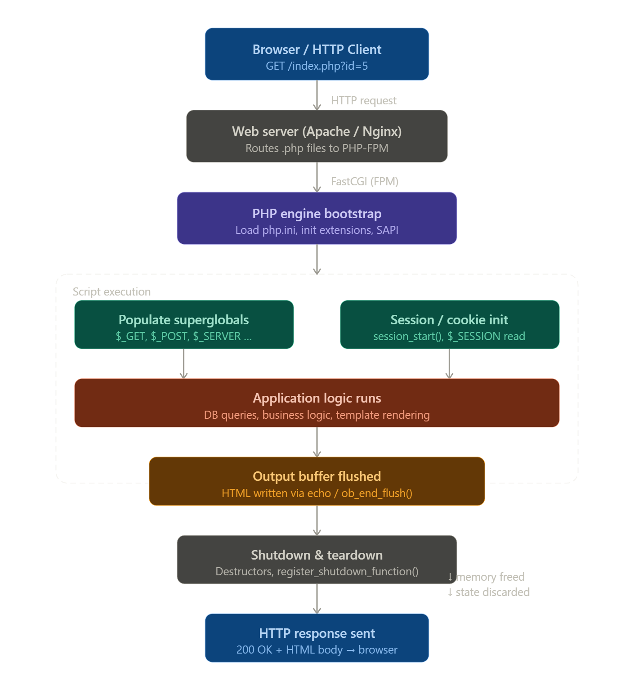

# Full Stack Interview Preparation Guide

> This guide is created as a complete interview preparation roadmap for **Full Stack Developers**. It is designed to help candidates revise core concepts, strengthen **fundamentals**, and confidently face **technical interviews** across the entire full stack ecosystem.

---

## 📑 Next.js

> Next.js is a full-stack React framework built by Vercel for building scalable, production-ready web applications with hybrid rendering capabilities.

| Topics                                                                      | Overview                                                          |
| --------------------------------------------------------------------------- | ----------------------------------------------------------------- |
| [01. Core Architecture & Fundamentals](#01-core-architecture--fundamentals) | App Router, RSC, layout hierarchy, metadata API, build vs runtime |
| [02. Advanced Routing System](#02-advanced-routing-system)                  | Dynamic routes, route groups, parallel & intercepting routes      |
| [03. Rendering Strategies](#03-rendering-strategies)                        | Static vs Dynamic, SSR, ISR, Streaming, PPR, Edge runtime         |
| [04. Data Fetching & Mutations](#04-data-fetching--mutations)               | Server Components, fetch caching, Server Actions, revalidation    |
| [05. API Routes & Middleware](#05-api-routes--middleware)                   | Route Handlers, Edge vs Node runtime, middleware patterns         |
| [06. Authentication & Security](#06-authentication--security)               | Auth.js, OAuth, JWT, RBAC, cookies, CSRF, security headers        |
| [07. Performance Optimization](#07-performance-optimization)                | Bundle analysis, code splitting, caching, image/font optimization |
| [08. SEO & Accessibility](#08-seo--accessibility)                           | Metadata, OpenGraph, sitemap, structured data, accessibility      |
| [09. Debugging & Profiling](#09-debugging--profiling)                       | Hydration debugging, monitoring, Web Vitals, bundle budgeting     |
| [10. Testing Strategy](#10-testing-strategy)                                | Unit, integration, API mocking, E2E testing                       |
| [11. Advanced Patterns](#11-advanced-patterns)                              | Edge logic, i18n, PWA, real-time systems                          |

### 01. Core Architecture & Fundamentals

- [ ] Next.js 15+ Architecture (App Router only)
- [ ] Why Next.js over React (real production perspective)
- [ ] React Server Components (RSC) vs Client Components ('use client')
- [ ] File-based Routing (app/ directory conventions)
- [ ] Metadata API (title, description, OpenGraph, robots.txt)
- [ ] Loading UI & Suspense Boundaries
- [ ] Error Boundaries (error.js, not-found.js)
- [ ] App Router vs Pages Router migration
- [ ] Turbopack vs Webpack
- [ ] Build vs Runtime Concepts
- [ ] Remote patterns config
- [ ] Server-first rendering model
- [ ] Layout hierarchy (Root, Nested, Templates)
- [ ] Loading UI (loading.js)
- [ ] Error Boundaries (error.js, not-found.js)
- [ ] Metadata API (SEO, OpenGraph, robots)
- [ ] Static vs Dynamic rendering detection

### 02. Advanced Routing System

#### 🔹 App Router

- [ ] App Router Architecture
- [ ] Layout Hierarchy Model
- [ ] Server-first mindset
- [ ] Streaming & Partial Rendering
- [ ] Route Segments & Rendering Tree

#### 🔹 File-Based Routing

- [ ] Static Routes
- [ ] Dynamic Routes [slug], [id]
- [ ] Catch-All [...slug]
- [ ] Optional Catch-All [[...slug]]
- [ ] Route Groups (group)
- [ ] Parallel Routes @slot
- [ ] Intercepting Routes (modal routing)

#### 🔹 Layout & Navigation

- [ ] Layout vs Template differences
- [ ] Nested Layout patterns
- [ ] Colocation strategy (components near route)
- [ ] next/navigation vs legacy router
- [ ] Link prefetching behavior
- [ ] Soft navigation vs full reload
- [ ] Redirects vs Rewrites

### 03. Rendering Strategies

#### 🔹 Rendering Modes

- [ ] Static Rendering (default when no dynamic usage)
- [ ] Dynamic Rendering (force-dynamic, cookies(), headers())
- [ ] Server-Side Rendering lifecycle
- [ ] Static Site Generation lifecycle
- [ ] On-demand revalidation (revalidatePath, revalidateTag)
- [ ] Streaming with Suspense
- [ ] Partial Prerendering (PPR)
- [ ] Edge Runtime rendering

#### 🔹 Rendering Decision Matrix

- [ ] When to choose Static
- [ ] When to choose Dynamic (SSR)
- [ ] When to use ISR
- [ ] When to use Edge Runtime
- [ ] Cost & performance trade-offs

### 04. Data Fetching & Mutations

#### 🔹 Server Components

- [ ] Async Server Components
- [ ] fetch() with Next.js caching
- [ ] cache: 'force-cache'
- [ ] cache: 'no-store'
- [ ] next: { revalidate }
- [ ] Streaming with use() directive

#### 🔹 Mutations

- [ ] Server Actions
- [ ] Form Actions (useFormState, useFormStatus)
- [ ] Optimistic UI updates
- [ ] Revalidation strategies

#### 🔹 Client Data Fetching

- [ ] SWR
- [ ] React Query
- [ ] Hydration strategy
- [ ] Error & Loading boundaries

### 05. API Routes & Middleware

#### 🔹 Route Handlers

- [ ] app/api/route.ts
- [ ] HTTP methods (GET, POST, PUT, DELETE)
- [ ] Validation (Zod schema)
- [ ] Streaming responses (ReadableStream)

#### 🔹 Runtime

- [ ] Node.js runtime
- [ ] Edge runtime differences
- [ ] Performance trade-offs

#### 🔹 Middleware

- [ ] middleware.ts
- [ ] Auth validation
- [ ] Redirect handling
- [ ] Geo-based logic
- [ ] A/B testing
- [ ] Rate limiting & CORS

### 06. Authentication & Security

- [ ] Auth.js (formerly NextAuth.js)
- [ ] OAuth Providers (Google, GitHub)
- [ ] Custom JWT + Cookies
- [ ] Server-side session validation
- [ ] Role-Based Access Control (RBAC)
- [ ] Protected routes via middleware
- [ ] HttpOnly cookies
- [ ] CSRF protection
- [ ] XSS prevention
- [ ] Security headers (CSP, HSTS)

### 07. Performance Optimization

- [ ] Bundle analysis
- [ ] Dynamic imports
- [ ] Code splitting strategy
- [ ] Tree shaking awareness
- [ ] Image optimization
- [ ] Font optimization
- [ ] Caching (HTTP, CDN, Edge)
- [ ] Partial Prerendering
- [ ] Avoiding large client bundles
- [ ] Web Vitals optimization

### 08. SEO & Accessibility

#### 🔹 SEO

- [ ] Metadata API
- [ ] Dynamic metadata
- [ ] OpenGraph tags
- [ ] Sitemap generation
- [ ] Robots.txt
- [ ] Structured data (JSON-LD)

#### 🔹 Accessibility

- [ ] Semantic HTML
- [ ] Keyboard Navigation
- [ ] ARIA roles
- [ ] Lighthouse optimization

### 09. Debugging & Profiling

- [ ] Error Monitoring (Sentry)
- [ ] Performance Monitoring (Web Vitals)
- [ ] Lighthouse 100/100 scores
- [ ] Memory leak detection
- [ ] Hydration error debugging
- [ ] Performance profiling
- [ ] React DevTools profiling
- [ ] Performance profiling
- [ ] Bundle size budgeting

### 10. Testing Strategy

- [ ] Unit Testing (Jest + RTL)
- [ ] API mocking (MSW)
- [ ] Integration testing
- [ ] E2E testing (Playwright / Cypress)
- [ ] Auth flow testing
- [ ] Visual regression testing

### 11. Advanced Patterns

#### 🔹 Middleware & Edge

- [ ] Edge Runtime Concept
- [ ] Request Interception
- [ ] Geo-based Rendering
- [ ] A/B Testing via Middleware
- [ ] Progressive Web App (PWA)

#### 🔹 Internationalization

- [ ] Built-in i18n Routing
- [ ] Dynamic Locale Handling
- [ ] SEO with Multi-language

#### 🔹 Real-time Systems

- [ ] WebSockets + Server-Sent Events
- [ ] Socket.io integration
- [ ] Serverless limitations

## 📑 Node.js

> Node.js is a JavaScript runtime built on Chrome’s V8 engine designed for scalable network applications and backend development.

| Topics                                                                        | Overview                                                                   |
| ----------------------------------------------------------------------------- | -------------------------------------------------------------------------- |
| [01. Introduction & Global Environment](#01-introduction--global-environment) | What is Node.js, installation, runtime basics, REPL, versioning            |
| [02. Node.js Architecture & Event Loop](#02-nodejs-architecture--event-loop)  | Single-threaded model, non-blocking I/O, event loop phases, libuv          |
| [03. Core Modules Deep Dive](#03-core-modules-deep-dive)                      | fs, path, os, http, events, buffer, stream, crypto                         |
| [04. Modules & Package Management](#04-modules--package-management)           | CommonJS vs ESM, package.json, npm, semver, dependency management          |
| [05. Asynchronous Programming](#05-asynchronous-programming)                  | Callbacks, Promises, async/await, error handling, microtasks vs macrotasks |
| [06. Streams & Buffer Management](#06-streams--buffer-management)             | Readable, writable, duplex, transform streams, backpressure handling       |
| [07. Building HTTP Servers & APIs](#07-building-http-servers--apis)           | Creating servers, routing, middleware concept, REST API basics             |
| [08. Working with Databases](#08-working-with-databases)                      | MongoDB driver, connection pooling, transactions, SQL integration          |
| [09. Authentication & Security](#09-authentication--security)                 | JWT, bcrypt, sessions, cookies, CSRF, XSS protection                       |
| [10. Error Handling & Debugging](#10-error-handling--debugging)               | Custom errors, global error handling, logging, debugging tools             |
| [11. Testing & Quality Assurance](#11-testing--quality-assurance)             | Unit testing, integration testing, Jest, mocking                           |
| [12. Performance Optimization](#12-performance-optimization)                  | Profiling, memory leaks, clustering, worker threads, caching               |
| [13. Deployment & Production](#13-deployment--production)                     | PM2, Docker, environment configs, CI/CD, graceful shutdown                 |
| [14. CLI Tools Development](#14-cli-tools-development)                        | Building CLI tools, argument parsing, publishing npm packages              |
| [15. Advanced Node Internals](#15-advanced-node-internals)                    | Child processes, worker threads, Node-API, stream internals                |

### 01. Introduction & Global Environment

#### `Core Basics`

<details>
<summary><b >What is Node.js ?</b></summary>

Node.js is powered by the Chrome V8 JavaScript engine and operates on an event-driven, non-blocking I/O model, ensuring high throughput and scalability. It enables JavaScript execution outside the browser, supporting file system access, HTTP servers, database operations, and more.

**Key Characteristics:**

1️⃣ Single-threaded Event Loop:

- Runs on a single main thread
- Uses an event loop to handle thousands of connections without creating new threads per request.
- Reduces memory overhead compared to traditional multi-threaded servers.

2️⃣ Non-Blocking I/O

- File system, network, and database operations run asynchronously
- The main thread does not wait for operations to complete
- Operations trigger events instead of blocking execution.
- High performance for I/O-heavy applications

3️⃣ Event-Driven Architecture

- Built around events and callbacks
- Uses EventEmitter internally
- Perfect for real-time systems (chat, streaming, APIs)

4️⃣ Asynchronous Programming Model

- Supports callbacks, Promises, and async/await.
- Efficient handling of background operations.
- Prevents thread blocking during long-running tasks.

5️⃣ Built on V8 JavaScript Engine

- Powered by Chrome’s V8 engine
- JIT (Just-In-Time) compilation
- Converts JavaScript into optimized machine code

6️⃣ libuv Library and Cross-Platform

- Handles asynchronous I/O operations
- Uses internal thread pool for blocking tasks (DNS, FS)
- Cross-platform abstraction layer (Windows, macOS, Linux)
- Supports ARM (IoT, Raspberry Pi, containers)

7️⃣ NPM Ecosystem

- Includes npm (Node Package Manager).
- Access to millions of open-source packages.
- Rapid development through reusable libraries.
- Strong community support.

8️⃣ Highly Scalable & Worker Threads

- Handles many concurrent connections efficiently.
- Suitable for APIs, microservices and distributed systems.
- Works well with horizontal scaling strategies.
- True multi-threading for CPU-intensive tasks
- Offloads heavy computation from event loop

9️⃣ Stream-Based Processing

- Uses streams for handling large data.
- Supports readable, writable, duplex, and transform streams.
- Enables efficient memory usage for large files.

🔟 Fast Data Processing

- JSON is native to JavaScript.
- Fast JSON parsing and response handling
- Perfect for REST APIs and real-time data exchange.

1️⃣1️⃣ Production-Ready Features

- Works with PM2, systemd, Docker
- Graceful shutdown & cluster reloads
- Observability with Logging, metrics, tracing support

</details>

<details>
<summary><b >Node.js vs Browser JavaScript</b></summary>

Both run JavaScript, but in completely different environments with different purposes:

| Feature             | Browser JS                       | Node.js                           |
| ------------------- | -------------------------------- | --------------------------------- |
| **Purpose**         | UI interaction, DOM manipulation | Server-side logic, backend        |
| **Environment**     | Inside a web browser             | Runs on your machine/server       |
| **Global Object**   | `window`                         | `global`                          |
| **File System**     | No (security reasons)            | Yes (`fs` module)                 |
| **HTTP Requests**   | Fetch API / XMLHttpRequest       | Built-in `http`/`https` modules   |
| **Modules**         | ES Modules (`import/export`)     | CommonJS (`require`) + ES Modules |
| **Package Manager** | CDN / bundlers                   | npm / yarn                        |

</details>

<details>
<summary><b >Runtime vs Framework</b></summary>

**What is a Runtime?** => A Runtime is the environment where your code executes. It provides the core engine, memory management, and low-level system access needed to actually run your program.

**What is a Framework?** => A Framework is a pre-built structure/toolkit that provides rules, patterns, and tools to help you build applications faster. It runs on top of a runtime.

</details>

<details>
<summary><b >V8 Engine overview</b></summary>

V8 is the translator + executor — it takes your JavaScript code and turns it into machine code that your CPU can directly understand and run.

**_How V8 Works_**

```md
JS Code → [Parser] → AST → [Ignition] → Bytecode
↓
[TurboFan]
↓
Optimized Machine Code
↓
CPU Runs It
```

```javascript
/* Step 1 — Parsing V8 reads JS and builds an AST (Abstract Syntax Tree) */
const add = (a, b) => a + b;

/*
 V8 sees it as a tree:
 VariableDeclaration
   └── ArrowFunctionExpression
        ├── Params: [a, b]
        └── BinaryExpression: a + b
*/

/* Step 2 — Ignition (Interpreter) */

//Converts AST → **Bytecode** (faster to start executing)


// Ignition Bytecode (simplified):
LdaNamedProperty a        // Load variable 'a'
Add b                     // Add 'b' to it
Return                    // Return result


/* Step 3 — TurboFan (JIT Compiler) */

/* Watches **hot code** (frequently run code) and compiles it to
highly optimized **native machine code** */


// TurboFan output (conceptual x86 assembly):
MOV eax, [a]
ADD eax, [b]
RET


/* Step 4 — Garbage Collection (Orinoco) */

// V8 automatically frees unused memory so you don't have to


function createUser() {
  let user = { name: 'Rahim', age: 25 }; // allocated in memory
  return user.name;
} // 'user' object → no longer referenced → V8 GC cleans it up

```

**Example: V8 in Chrome DevTools**

```javascript
// This function will be HOT (called many times) → TurboFan optimizes it
function fibonacci(n) {
  if (n <= 1) return n;
  return fibonacci(n - 1) + fibonacci(n - 2);
}

// Cold run — Ignition interprets
console.time('cold');
fibonacci(30);
console.timeEnd('cold'); // ~15ms

// Hot run — TurboFan has compiled it
console.time('hot');
fibonacci(30);
console.timeEnd('hot'); // ~2ms ← same code, MUCH faster ⚡
```

**V8 Engine — Key Components**

| Component     | Role                                                          |
| ------------- | ------------------------------------------------------------- |
| **Parser**    | Reads JS → builds AST                                         |
| **Ignition**  | AST → Bytecode (interpreter)                                  |
| **TurboFan**  | Bytecode → Optimized machine code (JIT)                       |
| **Orinoco**   | Garbage Collector — frees unused memory                       |
| **Liftoff**   | WebAssembly baseline compiler                                 |
| **Sparkplug** | Fast non-optimizing JS compiler (between Ignition & TurboFan) |

</details>

<details>
<summary><b >package.json basics</b></summary>

TypeScript is an open-source programming language developed

</details>

#### `Global Environment`

<details>
<summary><b >global object</b></summary>

TypeScript is an open-source programming language developed

</details>

<details>
<summary><b >process object</b></summary>

TypeScript is an open-source programming language developed

</details>

<details>
<summary><b >process.argv</b></summary>

TypeScript is an open-source programming language developed

</details>

<details>
<summary><b >Environment variables</b></summary>

TypeScript is an open-source programming language developed

</details>

<details>
<summary><b >__dirname, __filename</b></summary>

TypeScript is an open-source programming language developed

</details>

<details>
<summary><b >process exit events</b></summary>

TypeScript is an open-source programming language developed

</details>

### 02. Node.js Architecture & Event Loop

<details>
<summary><b >Single-threaded model</b></summary>

Node.js is single-threaded for JavaScript, but internally it can still use a thread pool (via libuv) for some heavy I/O tasks.

**The Single-Threaded Model in Node.js means:\***

- JavaScript runs on one main thread
- Tasks execute sequentially
- I/O operations are asynchronous
- The event loop handles callbacks and concurrency

**Why Node.js Uses a Single Thread**

The single-threaded design is ideal for I/O-heavy applications, such as:

- API servers
- Real-time chat applications
- Streaming platforms
- Microservices

**Advantages:**

- ✔ Lower memory usage – fewer threads are created
- ✔ No context switching overhead
- ✔ High scalability for concurrent requests

```js
/! Example 1: Execution Order /;

console.log('1️⃣  Start'); // Runs first

setTimeout(() => {
  console.log('3️⃣  Timeout done'); // Runs last (async)
}, 0);

console.log('2️⃣  End'); // Runs second

// OUTPUT:
// 1️⃣  Start
// 2️⃣  End
// 3️⃣  Timeout done

> Even with 0ms delay, the timeout waits — the main thread finishes first.
```

```js
/! Example 2: Non-Blocking Web Server /;

const http = require('http');
const fs = require('fs');

const server = http.createServer((req, res) => {
  if (req.url === '/fast') {
    // ✅ Instant response — doesn't block others
    res.end('Fast response!');
  }

  if (req.url === '/file') {
    // ✅ File read is handed off to libuv (background)
    // The single thread is FREE to handle other requests
    fs.readFile('./data.txt', 'utf8', (err, data) => {
      res.end(data || 'File loaded!');
    });
  }
});

server.listen(3000, () => {
  console.log('Server running on port 3000');
});
```

**What happens when 3 users hit `/file` simultaneously:**

```
User A → readFile handed to libuv → thread FREE ──┐
User B → readFile handed to libuv → thread FREE ──┤ All handled!
User C → readFile handed to libuv → thread FREE ──┘
         ↓
    Callbacks fire when each file is ready
```

> **The golden rule: Node.js is fast not because it's multi-threaded — but because it never waits. It delegates and moves on.**

</details>

<details>
<summary><b >Event-driven architecture</b></summary>

Event-Driven Architecture is a programming pattern where the flow of the program is controlled by events and event handlers (listeners).

#### 1. What is an Event?

An event is any action or occurrence that happens in the system.

- A user sends an HTTP request
- A file finishes reading
- A database query completes
- A timer finishes
- A button is clicked (in browsers)

```md
#### Event-Driven Flow:

User Action / System Event
↓
Event Queue
↓
Event Loop
↓
Event Listener
↓
Callback Function Executes
```

```js
/! Real-World Example — HTTP Server

const http = require("http");

const server = http.createServer();

// Listen for "request" events
server.on("request", (req, res) => {
  console.log(`Request received: ${req.url}`);
  res.end("Hello World!");
});

// Listen for "connection" events
server.on("connection", (socket) => {
  console.log("New client connected!");
});

// Listen for "error" events
server.on("error", (err) => {
  console.error(`Server error: ${err.message}`);
});

server.listen(3000, () => {
  console.log("Listening on port 3000...");
});

```

```md
Browser hits localhost:3000
│
▼
"connection" fires ──▶ logs "New client connected!"
│
▼
"request" fires ──▶ logs URL, sends response
```

```js
/! Real-World Example — File Stream

const fs = require("fs");

const stream = fs.createReadStream("bigfile.txt");

// Fires repeatedly as chunks arrive
stream.on("data", (chunk) => {
  console.log(`Received ${chunk.length} bytes`);
});

// Fires once when the file is fully read
stream.on("end", () => {
  console.log("File reading complete ✅");
});

// Fires if something goes wrong
stream.on("error", (err) => {
  console.error("Read error:", err.message);
});
```

```md
bigfile.txt (500MB)
│
▼
"data" ──▶ chunk 1 (64KB)
"data" ──▶ chunk 2 (64KB)
"data" ──▶ chunk 3 (64KB)
...
"end" ──▶ done! ✅

✅ Memory stays low — no full file loaded at once
```

</details>

<details>
<summary><b >Non-blocking I/O</b></summary>

Non-Blocking I/O (Input/Output) means that when the program performs operations like reading files, accessing a database, or making network requests, it does not stop the execution of other code while waiting for the operation to complete.

**Blocking (Synchronous) I/O:**

The program waits until the task finishes before moving to the next line.

```js
const fs = require('fs');

console.log('1️⃣  Start');

// 🚨 BLOCKS the entire thread until file is read
const data = fs.readFileSync('file.txt', 'utf8');
console.log('2️⃣  File data:', data);

console.log('3️⃣  End');

// OUTPUT (in order, but thread was FROZEN at step 2):
// 1️⃣  Start
// 2️⃣  File data: hello world
// 3️⃣  End
```

```
Timeline:
──────────────────────────────────────
[Start] ──▶ [😴 FROZEN reading file] ──▶ [End]
             nobody else gets served!
```

**Non-Blocking (Asynchronous) I/O:**

The program does not wait for the operation to finish.

```js
const fs = require('fs');

console.log('1️⃣  Start');

// ✅ Hands off to OS — thread stays FREE
fs.readFile('file.txt', 'utf8', (err, data) => {
  console.log('3️⃣  File data:', data); // fires LATER
});

console.log('2️⃣  End');

// OUTPUT:
// 1️⃣  Start
// 2️⃣  End              ← thread didn't wait!
// 3️⃣  File data: hello world  ← callback fires when ready
```

```
Timeline:
──────────────────────────────────────────────
[Start] ──▶ [delegate file read] ──▶ [End] ──▶ [callback fires]
                    ↓
              OS reads file
              in background ✅
```

---

# Redis

> Redis (Remote Dictionary Server) is an open-source, in-memory data structure store used as a database, cache, message broker, and session store.

## Table of Contents

| Topics                                                         | Overview                                       |
| -------------------------------------------------------------- | ---------------------------------------------- |
| [01. Installation & Setup](#01-installation--setup)            | Install, start service, verify connection      |
| [02. Configuration](#02-configuration)                         | redis.conf, bind, port, memory, eviction       |
| [03. Persistence](#03-persistence)                             | RDB snapshot, AOF, backup directory            |
| [04. Security](#04-security)                                   | Password, firewall, TLS, dangerous commands    |
| [05. Data Structures](#05-data-structures)                     | String, List, Hash, Set, Sorted Set, Bitmap    |
| [06. Core Commands](#06-core-commands)                         | CRUD, expiry, keys, transactions               |
| [07. Caching Patterns](#07-caching-patterns)                   | Cache-aside, TTL, eviction, invalidation       |
| [08. Performance](#08-performance)                             | Pipeline, connection pool, slow log, lazy free |
| [09. Pub/Sub & Streams](#09-pubsub--streams)                   | Publish, subscribe, consumer groups            |
| [10. Monitoring](#10-monitoring)                               | INFO, memory, hit rate, Grafana                |
| [11. High Availability](#11-high-availability)                 | Sentinel, Cluster, replication                 |
| [12. Production Best Practices](#12-production-best-practices) | Key naming, backup, versioning, separation     |

---

## 01. Installation & Setup

- [ ] Install Redis (`apt install redis` / `brew install redis` / Docker)
- [ ] Start Redis service (`systemctl start redis` / `redis-server`)
- [ ] Verify connection (`redis-cli ping` → should return `PONG`)
- [ ] Check Redis version (`redis-cli INFO server | grep redis_version`)
- [ ] Connect via Redis CLI (`redis-cli -h 127.0.0.1 -p 6379`)
- [ ] Run with Docker (`docker run -d -p 6379:6379 redis`)

---

## 02. Configuration (`redis.conf`)

### 🔹 Network

- [ ] Set bind address (`bind 127.0.0.1`)
- [ ] Consider changing default port (`6379`)
- [ ] Keep protected mode enabled (`protected-mode yes`)
- [ ] Enable TCP keepalive (`tcp-keepalive 60`)
- [ ] Set idle connection timeout (`timeout 300`)

### 🔹 Memory

- [ ] Set max memory limit (`maxmemory 512mb`)
- [ ] Configure eviction policy (`maxmemory-policy allkeys-lru`)
- [ ] Enable lazy freeing (`lazyfree-lazy-eviction yes`)

### 🔹 Logging

- [ ] Set log level (`loglevel notice`)
- [ ] Set log file path (`logfile /var/log/redis/redis.log`)
- [ ] Enable slow log (`slowlog-log-slower-than 10000`)

---

## 03. Persistence

### 🔹 RDB (Snapshot)

- [ ] Enable RDB snapshots (`save 900 1` / `save 300 10` / `save 60 10000`)
- [ ] Set RDB filename (`dbfilename dump.rdb`)
- [ ] Set backup directory (`dir /var/lib/redis`)
- [ ] Keep RDB compression enabled (`rdbcompression yes`)

### 🔹 AOF (Append Only File)

- [ ] Decide on AOF usage (`appendonly yes`)
- [ ] Configure AOF fsync policy (`appendfsync everysec`)
- [ ] Set AOF rewrite threshold (`auto-aof-rewrite-percentage 100`)
- [ ] Set AOF file path (`appendfilename appendonly.aof`)

---

## 04. Security

- [ ] Set a strong password (`requirepass YourStrongPassword123!`)
- [ ] Rename dangerous commands (`rename-command FLUSHALL ""`)
- [ ] Disable `FLUSHDB` command in production
- [ ] Disable `DEBUG` command in production
- [ ] Restrict port access via firewall (trusted IPs only)
- [ ] Set up TLS/SSL (`tls-port 6380` + certificate config)
- [ ] Run Redis as a non-root user
- [ ] Isolate Redis inside a VPC or network namespace

---

## 05. Data Structures

### 🔹 String

- [ ] `SET` / `GET` — set and read a value
- [ ] `INCR` / `DECR` — increment/decrement a counter
- [ ] `APPEND` — append to an existing value
- [ ] `MSET` / `MGET` — set and get multiple keys at once

### 🔹 List

- [ ] `LPUSH` / `RPUSH` — push from left/right
- [ ] `LPOP` / `RPOP` — pop from left/right
- [ ] `LRANGE` — read a specific range
- [ ] `LLEN` — get list length

### 🔹 Hash

- [ ] `HSET` / `HGET` — set and read a field
- [ ] `HMSET` / `HMGET` — multiple fields at once
- [ ] `HGETALL` — get all fields and values
- [ ] `HDEL` — delete a field

### 🔹 Set

- [ ] `SADD` / `SMEMBERS` — add and view members
- [ ] `SISMEMBER` — check if a member exists
- [ ] `SUNION` / `SINTER` — union and intersection
- [ ] `SREM` — remove a member

### 🔹 Sorted Set

- [ ] `ZADD` — add a member with a score
- [ ] `ZRANGE` / `ZREVRANGE` — read in order
- [ ] `ZSCORE` — get score of a specific member
- [ ] `ZRANK` / `ZREVRANK` — get rank of a member

### 🔹 Bitmap & HyperLogLog

- [ ] `SETBIT` / `GETBIT` — set and read a bit
- [ ] `BITCOUNT` — count set bits
- [ ] `PFADD` / `PFCOUNT` — unique count estimation (HLL)

---

## 06. Core Commands

### 🔹 Key Management

- [ ] `EXISTS key` — check if a key exists
- [ ] `DEL key` — delete a key
- [ ] `EXPIRE key seconds` — set a TTL
- [ ] `TTL key` — check remaining time
- [ ] `PERSIST key` — remove TTL from a key
- [ ] `RENAME key newkey` — rename a key
- [ ] `TYPE key` — check the data type
- [ ] Use `SCAN` instead of `KEYS *` (avoids blocking in production)

### 🔹 Transactions

- [ ] `MULTI` / `EXEC` — begin and commit a transaction
- [ ] `DISCARD` — cancel a transaction
- [ ] `WATCH key` — optimistic locking

### 🔹 Scripting

- [ ] `EVAL` — run a Lua script
- [ ] `EVALSHA` — run a cached script

---

## 07. Caching Patterns

- [ ] Implement cache-aside pattern
- [ ] Always set a TTL (`EXPIRE key 3600`)
- [ ] Handle cache stampede problem
- [ ] Define a cache invalidation strategy
- [ ] Choose write-through vs write-behind approach
- [ ] Identify and resolve hot key issues
- [ ] Serialize large objects before storing
- [ ] Separate cache by namespace (`user:cache:*`)

---

## 08. Performance

- [ ] Avoid `KEYS *` command — use `SCAN` instead
- [ ] Use pipelining to send multiple commands at once
- [ ] Set up a connection pool
- [ ] Enable lazy freeing (`lazyfree-lazy-eviction yes`)
- [ ] Review slow log regularly (`SLOWLOG GET`)
- [ ] Compress large values before storing
- [ ] Use `O(N)` complexity commands with caution
- [ ] Choose appropriate data structures (Hash vs String)
- [ ] Use batch operations (`MGET`, `MSET`, `HMGET`)

---

## 09. Pub/Sub & Streams

### 🔹 Pub/Sub

- [ ] `SUBSCRIBE channel` — subscribe to a channel
- [ ] `PUBLISH channel message` — publish a message
- [ ] `UNSUBSCRIBE` — unsubscribe from a channel
- [ ] `PSUBSCRIBE pattern` — pattern-based subscription

### 🔹 Streams (Redis 5.0+)

- [ ] `XADD` — add an entry to a stream
- [ ] `XREAD` — read from a stream
- [ ] `XGROUP CREATE` — create a consumer group
- [ ] `XREADGROUP` — read as a group
- [ ] `XACK` — acknowledge a message

---

## 10. Monitoring

- [ ] Check health with `INFO` command (`redis-cli INFO stats`)
- [ ] Monitor memory usage regularly (`INFO memory`)
- [ ] Track connected client count (`CLIENT LIST`)
- [ ] Monitor cache hit rate (80%+ is healthy)
- [ ] Enable keyspace notifications if needed
- [ ] Use `MONITOR` command for real-time command inspection (dev only)
- [ ] Set up Redis Exporter (Prometheus)
- [ ] Build a Grafana dashboard
- [ ] Define alert rules (memory usage, latency thresholds)

---

## 11. High Availability

### 🔹 Replication

- [ ] Set up master-replica replication
- [ ] Configure `replicaof <masterip> <masterport>`
- [ ] Keep replicas read-only (`replica-read-only yes`)
- [ ] Monitor replication lag

### 🔹 Sentinel

- [ ] Set up Redis Sentinel (minimum 3 nodes)
- [ ] Test automatic failover
- [ ] Define Sentinel quorum
- [ ] Use a Sentinel-aware client in the application

### 🔹 Cluster

- [ ] Set up Redis Cluster (minimum 6 nodes)
- [ ] Verify hash slot distribution
- [ ] Check cluster status with `CLUSTER INFO`
- [ ] Use a cluster-aware client library

---

## 12. Production Best Practices

- [ ] Define a key naming convention (`user:42:profile`)
- [ ] Take regular backups (`.rdb` file to S3 or external storage)
- [ ] Keep Redis version up to date (security patches)
- [ ] Use separate instances for cache and session storage
- [ ] Set memory limit correctly (max 75% of available RAM)
- [ ] Disable swap memory on Linux
- [ ] Set `vm.overcommit_memory = 1` on Linux
- [ ] Disable `transparent_hugepage` on Linux
- [ ] Implement circuit breaker pattern in the application
- [ ] Ensure graceful shutdown of Redis connections
- [ ] Test production config in a staging environment
- [ ] Create a disaster recovery plan

## What Counts as I/O?

```
I/O = anything that talks to the outside world

┌─────────────────────────────────────────────┐
│              I/O OPERATIONS                 │
│                                             │
│  📁 File System    → fs.readFile()          │
│  🌐 Network        → http.request()         │
│  🗄️  Database      → db.query()             │
│  ⏱️  Timers        → setTimeout()           │
│  🔌 Sockets        → net.connect()          │
│  🖥️  Child Process → exec()                 │
└─────────────────────────────────────────────┘

All of these are handed off to libuv — thread stays FREE
```

</details>

<details>
<summary><b >libuv overview</b></summary>

libuv is the C library underneath Node.js that handles all asynchronous I/O operations.

```js
// OS-Level Async (Network I/O)

const net = require('net');

// Network I/O → handled directly by OS kernel
// libuv uses: epoll (Linux), kqueue (macOS), IOCP (Windows)
const server = net.createServer((socket) => {
  socket.on('data', (data) => {
    socket.write('Echo: ' + data);
  });
});

server.listen(3000);
```

```
Network request arrives
        │
        ▼
  libuv tells OS: "notify me when data arrives"
        │
        ▼
  OS watches the socket (epoll/kqueue)
        │
  Data arrives!
        │
        ▼
  OS notifies libuv ──▶ callback pushed to queue ──▶ Event Loop runs it ✅

  ✅ Zero threads used — pure OS-level efficiency

```

</details>

</details>

<details>
<summary><b >Thread pool concept</b></summary>

libuv is the C library underneath Node.js that handles all asynchronous I/O operations.

```js
// OS-Level Async (Network I/O)

const net = require('net');

// Network I/O → handled directly by OS kernel
// libuv uses: epoll (Linux), kqueue (macOS), IOCP (Windows)
const server = net.createServer((socket) => {
  socket.on('data', (data) => {
    socket.write('Echo: ' + data);
  });
});

server.listen(3000);
```

```
Network request arrives
        │
        ▼
  libuv tells OS: "notify me when data arrives"
        │
        ▼
  OS watches the socket (epoll/kqueue)
        │
  Data arrives!
        │
        ▼
  OS notifies libuv ──▶ callback pushed to queue ──▶ Event Loop runs it ✅

  ✅ Zero threads used — pure OS-level efficiency

```

</details>

#### Event Loop Deep Dive

- Event loop phases:
  - Timers
  - Pending callbacks
  - Idle / prepare
  - Poll
  - Check
  - Close callbacks
- Microtasks queue
- Macrotasks queue
- process.nextTick vs setImmediate
- setTimeout vs setImmediate
- Event loop internals

### 03. Core Modules (Built-in Modules)

<details>
<summary><b >File System (fs)</b></summary>

Node.js core modules like `fs` (File System) provide built-in functionality for file and directory operations without external dependencies. The fs module supports both synchronous (blocking) and asynchronous (non-blocking) methods, with modern promise-based APIs for cleaner async code.

**readFile / readFileSync:** `readFile` reads file content asynchronously using callbacks, while `readFileSync` does so synchronously, blocking execution until complete. Use async for better performance in I/O-heavy apps.

**writeFile / writeFileSync:** writeFile overwrites or creates a file asynchronously; writeFileSync does the same synchronously. Both accept encoding like 'utf8' for text files.

**appendFile:** `appendFile` adds content to a file's end asynchronously (creates if missing); there's also appendFileSync. Ideal for logs without overwriting.

**fs.promises - Modern Async/Await Style:** fs.promises provides promise-based versions of async methods, enabling async/await for readable code (Node.js 10+).

**Directory Operations:** Methods like `mkdir/mkdirSync` create directories, `readdir/readdirSync` list contents, `rmdir/rmdirSync` (or rm in newer Node) remove them.

**File Watching:** `watch` or `watchFile` monitors file changes, calling a listener on modify/add/rename/delete. Use fs.promises.watch for async.

**File Streams:** Streams handle large files efficiently via chunks: `createReadStream` for reading, `createWriteStream` for writing. Use pipeline for safe chaining.

```js
/* Real-World — Copy large file with progress */

const fs = require('fs');
const path = require('path');

async function copyWithProgress(src, dest) {
  const { size } = await require('fs').promises.stat(src);
  let transferred = 0;

  const readStream = fs.createReadStream(src);
  const writeStream = fs.createWriteStream(dest);

  readStream.on('data', (chunk) => {
    transferred += chunk.length;
    const pct = ((transferred / size) * 100).toFixed(1);
    process.stdout.write(`\rCopying... ${pct}%`);
  });

  readStream.pipe(writeStream);

  writeStream.on('finish', () => {
    console.log(`\nCopied ${path.basename(src)} → ${dest} ✅`);
  });
}

copyWithProgress('bigvideo.mp4', 'backup/bigvideo.mp4');
```

```
Copying... 23.4%
Copying... 67.8%
Copying... 100.0%
Copied bigvideo.mp4 → backup/bigvideo.mp4 ✅
```

```
## Quick Reference

METHOD                      ASYNC?    USE FOR
──────────────────────────────────────────────────────────
fs.readFile()               ✅ async  read small–medium files
fs.readFileSync()           ❌ sync   startup config only
fs.writeFile()              ✅ async  write/overwrite a file
fs.writeFileSync()          ❌ sync   startup/scripts only
fs.appendFile()             ✅ async  add to end of file
fs.promises.readFile()      ✅ async  modern await style
fs.promises.writeFile()     ✅ async  modern await style
fs.mkdir()                  ✅ async  create directory
fs.readdir()                ✅ async  list directory contents
fs.unlink()                 ✅ async  delete a file
fs.rename()                 ✅ async  rename or move a file
fs.stat()                   ✅ async  get file info / metadata
fs.watch()                  🔁 event  watch file/dir for changes
fs.createReadStream()       🌊 stream  read large files in chunks
fs.createWriteStream()      🌊 stream  write large files in chunks
.pipe()                     🌊 stream  connect read → write stream
```

```
## Key Rules to Remember

✅  Always use async versions inside servers and request handlers
✅  Use fs.promises with async/await for the cleanest code
✅  Use streams (pipe) for files larger than ~50MB
✅  Always handle errors — missing files crash the process
✅  { recursive: true } for nested mkdir / rm operations
⚠️  readFileSync / writeFileSync block the entire thread
⚠️  writeFile overwrites — use appendFile to add content
⚠️  fs.watch can be unreliable on some OS — use chokidar in production
```

</details>

<details>
<summary><b >Path</b></summary>

The `path` module provides utilities for working with file and directory paths — safely and cross-platform.

**1. path.join()** Joins multiple path segments into one clean path.

**2. path.resolve()** Resolves a sequence of paths into an absolute path — starting from the right.

**3. path.basename()** Returns the last part of a path — the filename.

**4. path.extname()** Returns the file extension including the dot.

```js
const path = require('path');
const fs = require('fs').promises;

class ProjectPaths {
  constructor(rootDir) {
    this.root = path.resolve(rootDir);
    this.src = path.join(this.root, 'src');
    this.public = path.join(this.root, 'public');
    this.uploads = path.join(this.root, 'public', 'uploads');
    this.logs = path.join(this.root, 'logs');
    this.config = path.join(this.root, 'config');
  }

  // Safely resolve a file under uploads
  uploadPath(filename) {
    const safe = path.basename(filename); // strip any ../ attacks
    return path.join(this.uploads, safe);
  }

  // Validate file extension before saving
  isAllowed(filename) {
    const ext = path.extname(filename).toLowerCase();
    return ['.jpg', '.png', '.pdf', '.txt'].includes(ext);
  }

  async createAll() {
    const dirs = [this.src, this.public, this.uploads, this.logs, this.config];
    for (const dir of dirs) {
      await fs.mkdir(dir, { recursive: true });
    }
    console.log('All project directories created ✅');
  }
}

const project = new ProjectPaths(__dirname);

(async () => {
  await project.createAll();

  console.log('Root:    ', project.root);
  console.log('Uploads: ', project.uploads);
  console.log('Upload:  ', project.uploadPath('../../../etc/passwd')); // safe!
  console.log('Allowed: ', project.isAllowed('resume.pdf')); // true
  console.log('Allowed: ', project.isAllowed('virus.exe')); // false
})();
```

```
All project directories created ✅
Root:     /home/user/myapp
Uploads:  /home/user/myapp/public/uploads
Upload:   /home/user/myapp/public/uploads/passwd   ← ../ stripped ✅
Allowed:  true
Allowed:  false
```

```
// Quick Reference

METHOD                             RETURNS
──────────────────────────────────────────────────────────────
path.join("a", "b", "c")          "a/b/c"
path.resolve("a", "b")            "/cwd/a/b"         (absolute)
path.basename("/dir/file.txt")    "file.txt"
path.basename("/dir/file.txt",    "file"
             ".txt")
path.extname("file.txt")          ".txt"
path.dirname("/dir/file.txt")     "/dir"
path.parse("/dir/file.txt")       { root, dir, base, ext, name }
path.format({ dir, name, ext })   "/dir/file.txt"
path.isAbsolute("/dir/file")      true / false
path.sep                          "/" or "\"
path.delimiter                    ":" or ";"
```

```
// Key Takeaways

✅  Always use path.join() instead of string concatenation for paths
✅  path.resolve() always returns an absolute path
✅  path.basename() extracts the filename from a full path
✅  path.extname() gets the file extension for type checking
✅  Use __dirname + path.join() to build paths relative to current file
✅  path protects against OS differences (/ vs \)
⚠️  path.extname("file.tar.gz") → ".gz" only (not ".tar.gz")
⚠️  path.resolve("/a", "/b") → "/b" (absolute segment resets path)
⚠️  Always use path.basename() to sanitize user-provided filenames

```

</details>

#### HTTP

- Create HTTP server
- Handle request & response
- Status codes
- Headers
- JSON response
- Manual routing

#### URL

- URL parsing
- URLSearchParams

#### Events

- EventEmitter
- Custom events
- Removing listeners

#### Buffer

- Creating buffers
- Encoding (utf8, base64)
- Binary data handling

#### Streams (Intro)

- Readable
- Writable
- Pipe
- Backpressure basics

#### OS

- CPU info
- Memory info

#### Crypto

- Hashing (sha256)
- Random bytes
- Basic encryption

#### Timers

- setTimeout
- setInterval
- setImmediate
- clearTimeout
- clearInterval
- clearImmediate
- process.nextTick

### 04. Modules & Package Management

<details>
<summary><b >CommonJS (require, module.exports)</b></summary>

CommonJS (CJS) is the module system built into Node.js — it lets you split code into separate files and share functionality between them.

**CommonJS — Key Takeaways**

1. **`module.exports`** — what your file shares with the world; nothing leaks out unless explicitly exported

2. **`require()`** — fetches another file's exports and brings them into your current file

3. **Each file is its own module** — variables stay private inside their file; no accidental global leaks

4. **`require()` is cached** — the file runs only once on first load; repeated `require()` calls return the same cached result

5. **Can export anything** — functions, objects, classes, arrays, strings, numbers — any valid JavaScript value

6. **Use `module.exports = {}`** not `exports = {}` for objects — reassigning `exports` breaks the reference to `module.exports`

7. **CommonJS is synchronous** — safe to use at startup/top of file, but never call `require()` inside async callbacks or request handlers mid-flight

</details>

<details>
<summary><b >ES Modules (import/export)</b></summary>

A module is just a file. Every .js file in ES Modules is its own isolated unit with its own scope, variables, and logic.

**CommonJS — Key Takeaways**

1. **`module.exports`** — what your file shares with the world; nothing leaks out unless explicitly exported

</details>

-
- CJS vs ESM differences
- Module resolution algorithm
- node_modules structure

#### package.json Deep Dive

- scripts
- dependencies vs devDependencies
- versioning
- main / type fields

#### npm Ecosystem

- npm install variations
- npx usage
- Global vs Local packages
- Semantic Versioning (SemVer)
- yarn / pnpm overview
- Creating custom npm package
- Publishing to npm

### 05. Asynchronous Programming

- Callback pattern
- Callback hell
- Promises
- Promise chaining
- async/await
- try/catch with async
- Error propagation
- Unhandled rejections
- Promise.all
- Promise.race
- util.promisify
- AbortController

### 06. Streams & Buffer Management

- What is a Stream?
- Types of Streams:
  - Readable
  - Writable
  - Duplex
  - Transform
- Stream events
- Pipe chaining
- Transform streams
- Backpressure deep explanation
- Handling large files efficiently
- Buffer vs Stream comparison

### 07. Building HTTP Servers & REST APIs

- Creating HTTP server
- REST API fundamentals
- Basic routing logic
- Handling query parameters
- Parsing request body
- Handling JSON
- Middleware pattern
- CORS handling
- Serving static files
- API versioning
- Status code best practices
- Error response standardization
- Environment configuration

### 08. Working with Databases

#### MongoDB

- Connecting with native driver
- Connection pooling
- CRUD operations
- Transactions
- Handling DB errors
- Data validation
- Mongoose overview

#### SQL

- PostgreSQL/MySQL integration
- Basic queries
- ORM overview
- Migration concept

### 09. Authentication & Security

- Password hashing (bcrypt)
- JWT creation & verification
- Access vs Refresh token
- Sessions vs Tokens
- Cookie handling
- CSRF protection
- XSS prevention
- Rate limiting
- Helmet usage
- Secure headers
- Environment variable security
- Input validation
- Avoiding SQL/NoSQL injection
- HTTPS & TLS basics

### 10. Error Handling & Debugging

- Error-first callback pattern
- Creating custom error classes
- Centralized error handling
- try/catch best practices
- Logging strategies
- Unhandled rejections
- Stack trace analysis
- Debug flag
- Using Node Inspector
- Using debug module

### 11. Testing & Quality Assurance

- Unit testing basics
- Integration testing
- Testing async code
- Jest setup
- Mocha overview
- Supertest for API testing
- Mocking
- Test coverage
- TDD basics

### 12. Performance & Optimization

- Performance hooks
- Profiling
- Memory usage monitoring
- Detecting memory leaks
- Garbage collection basics
- Cluster module
- Worker threads
- Horizontal scaling
- Load balancing
- Caching strategy (Redis overview)
- Gzip compression
- HTTP keep-alive

### 13. Deployment & Production

- Production environment setup
- dotenv usage
- PM2 process manager
- Dockerizing Node app
- CI/CD basics
- Logging in production
- Monitoring tools
- Health checks
- Graceful shutdown
- Handling SIGINT & SIGTERM
- Zero downtime deployment

### 14. CLI Tools Development

- Creating CLI tool
- Parsing arguments
- Commander usage
- Yargs usage
- Shebang (#!/usr/bin/env node)
- Making CLI executable
- Publishing CLI to npm

### 15. Advanced Node Internals

- Child process (exec, spawn, fork)
- Worker threads
- Cluster vs Worker comparison
- Event loop internals deep dive
- Libuv deep dive
- Native addons overview (C++)
- Node-API introduction
- Stream internals
- ESM loader hooks

## 📑 TypeScript

| Topics                                                                                | Overview                                                               |
| ------------------------------------------------------------------------------------- | ---------------------------------------------------------------------- |
| [01. Introduction & Project Setup](#01-introduction--project-setup)                   | TypeScript basics, setup, and project initialization workflow          |
| [02. Core Types & Type System Foundations](#02-core-types--type-system-foundations)   | Primitive types, arrays, objects, unions, literals, and fundamentals   |
| [03. Functions & Function Typing](#03-functions--function-typing)                     | Typed functions, parameters, return types, optional & default values   |
| [04. Type Narrowing & Type System Analysis](#04-type-narrowing--type-system-analysis) | Conditional checks, control flow, and safe type refinement             |
| [05. Generics & Reusable Type Patterns](#05-generics--reusable-type-patterns)         | Writing flexible, reusable, and type-safe components using generics    |
| [06. Classes & OOP in TypeScript](#06-classes--oop-in-typescript)                     | Classes, interfaces, access modifiers, inheritance, and OOP principles |
| [07. Built-in Utility Types](#07-built-in-utility-types)                              | Leveraging Partial, Pick, Omit, and other utility types effectively    |

### 01. Introduction & Project Setup

<details>
<summary><b >What is TypeScript ?</b></summary>

TypeScript is an open-source programming language developed by Microsoft that's a superset of JavaScript, adding optional static typing and advanced features like interfaces and generics. It compiles down to plain JavaScript, making it fully compatible with all existing JS code and environments. This allows developers to catch errors at compile time rather than runtime, improving code reliability for large-scale applications.

</details>

<details>
<summary><b >Why Use TypeScript ? </b></summary>

There are several reasons why developers prefer TypeScript over plain JavaScript:

- Superior Tooling:
  - Provides IntelliSense, autocompletion,
  - Refactoring, and navigation in IDEs.
- Early Error Detection at Compile Time
- Enhanced Code Quality
  - Static typing ensures predictability—no unexpected type changes.
  - Safe refactoring across large files
- Better Maintainability
  - Clearer Codebase
  - Easier Debugging
- Improved Team Collaboration
  - Explicit type contracts define function inputs/outputs.
  - Consistent codebase standards across developers.
- Scalability
  - Handles large codebases with modules and namespaces.
  - Supports modular architecture for growing apps.
- Smart Type Inference
  - Minimal Type Annotations
  - Auto-Completion
- Better Integration with Modern Frameworks
  - Seamless Integration
  - Strict Mode in JavaScript
- Community and Ecosystem Support
  - Growing Ecosystem
  - Active Development and Maintenance
  - Future-Proofing
  </details>

<details>
<summary><b >TypeScript vs JavaScript</b></summary>

| Feature/Aspect         | JavaScript                     | TypeScript                            |
| ---------------------- | ------------------------------ | ------------------------------------- |
| Typing System          | Dynamic (runtime)              | Static (compile-time, optional)       |
| Error Detection        | Runtime                        | Compile-time                          |
| File Extension         | `.js`                          | `.ts`                                 |
| Compilation            | Not required                   | Required (Transpiled using TSC)       |
| Tooling & IntelliSense | Basic IDE support              | IntelliSense, refactoring, navigation |
| Scalability            | Good for small/medium projects | Built for large enterprise apps       |
| Learning Curve         | Easy for beginners             | Slightly harder than JavaScript       |

</details>

<details>
<summary><b >How TypeScript Works ? </b></summary>

TypeScript operates through a compilation pipeline that transforms your .ts code into executable JavaScript.

Core Compilation Flow:

- **Parsing** → TypeScript compiler (tsc) reads .ts / .tsx files and converts the source code into an Abstract Syntax Tree (AST) that represents the program structure.
- **Binding** → Identifiers such as variables, functions, classes, and imports are linked across scopes and files.
- **Type Checking** → Analyzes types of all variables, parameters, returns—catches errors before runtime
- **Emission (Transpilation)** → All TypeScript-specific syntax and type annotations are removed, and clean JavaScript (.js) files are generated according to tsconfig.json.
- **Execution** → The generated JavaScript runs normally in browsers or Node.js, with no TypeScript overhead at runtime.

```javascript
// Compilation stages

TypeScript Source (.ts / .tsx)
    ↓
Parsing
    ↓
Binding
    ↓
Type Checking
    ↓
Emission / Transpilation
    ↓
JavaScript Output (.js)
    ↓
Browser / Node.js
```

</details>

<details>
<summary><b >Installation & Environment Setup</b></summary>

To work with TypeScript, you need the following tools installed on your system:

- Node.js (JavaScript runtime)
- npm (Node Package Manager)
- TypeScript Compiler (tsc)

```bash
  # TypeScript Installation process

  Install Node.js
      ↓
  Install TypeScript Compiler (tsc)
      ↓
  Create a Project Folder
      ↓
  Initialize TypeScript Configuration (tsconfig.json)
      ↓
  Write TypeScript Files (.ts / .tsx)
      ↓
  Compile TypeScript using tsc
      ↓
  Run the Generated JavaScript (.js)

```

```bash
  # one-liner setup

  npm install -g typescript ts-node && mkdir ts-app && cd ts-app && npm init -y && tsc --init

  # Essential dev tools

  npm i -D @types/node ts-node nodemon

  # Run directly (no compile step)

  npx ts-node src/index.ts
```

</details>

<details>
<summary><b>Basic Overview of tsconfig.json</b></summary>

The tsconfig.json file is the configuration file for TypeScript projects.
It tells the TypeScript compiler (tsc) how to compile the project, which files to include, and which rules to enforce.

**Purpose of tsconfig.json:**

- Project Compilation Control
  - Define which files and folders should be compiled
  - Specify output directories for JavaScript files
- Type Checking & Strictness
  - Enable strict type checking
  - Control null checks, implicit any, and other rules
- JavaScript Target & Module System
  - Set which version of JavaScript to output (ES5, ES6, ESNext)
  - Choose module system (CommonJS, ESNext, AMD, etc.)

- Additional Compiler Options
  - Enable source maps for debugging
  - Include/exclude files or directories
  - Enable decorators, JSX, or other advanced features

```javascript

  // Overview of tsconfig.json
  {
    "compilerOptions": {
      "target": "ES2018",        // JavaScript version output
      "module": "CommonJS",      // Module system
      "strict": true,            // Enable all strict type checks
      "outDir": "./dist",        // Output directory for JS files
      "rootDir": "./src",        // Root folder for TS source files
      "esModuleInterop": true,   // Compatibility with CommonJS modules
      "forceConsistentCasingInFileNames": true, // File naming consistency
      "skipLibCheck": true       // Skip type checking of declaration files
    },
    "include": ["src/**/*"],      // Files to include
    "exclude": ["node_modules"]   // Files to exclude
}

```

</details>

### 02. Core Types & Type System Foundations

<details>
<summary><b >Primitive Types</b></summary>

TypeScript primitive types are the basic, immutable data units that form the foundation of type-safe coding. They include `string`, `number`, `boolean`, `null`, `undefined`, `symbol`, `bigint`, — enforcing strict typing from compile-time.

```typescript
/*** All TypeScript primitive types in action (real example) ***/
type UserProfile = {
  name: string; // Text data
  age: number; // Numeric values (int/float)
  isActive: boolean; // True/false states
  role: 'admin' | 'user' | 'guest'; // Literal type (string literal)
  sessionId: symbol; // Unique identifier
  avatarUrl: string | null; // Optional string (nullable)
  lastLogin?: Date | undefined; // Optional date (may be undefined)
};

function createUserProfile(
  name: string,
  age: number,
  isActive: boolean,
): UserProfile {
  const uniqueId = Symbol('session'); // Each user gets unique symbol

  return {
    name,
    age,
    isActive,
    role: 'user' as const, // Literal type assignment
    sessionId: uniqueId,
    avatarUrl: null, // Explicitly no avatar yet
    lastLogin: undefined, // Not logged in yet
  };
}

// Real-world usage
const alice = createUserProfile('Alice', 28, true);
const bob = createUserProfile('Bob', 35, false);

console.log(alice.name.toUpperCase()); // "ALICE" - string method
console.log(alice.age.toFixed(0)); // "28" - number method
console.log(alice.isActive ? 'Online' : 'Offline'); // "Online" - boolean logic

/*
    Type safety in action - these would error:
    alice.age = "28"; // ❌ number expected
    alice.isActive = "yes"; // ❌ boolean expected
    alice.role = "moderator"; // ❌ literal type mismatch
  */
```

</details>

<details>
<summary><b >any vs unknown</b></summary>

any and unknown both accept any value, but unknown is safer as it requires type checking first. any completely disables type safety.

```typescript
// DANGER: any = runtime crashes
function parseUserAPI(data: any) {
  return {
    name: data.user.name, // ❌ Crashes if structure wrong
    email: data.user.email,
    age: data.user.age,
  };
}

// PERFECT: unknown = bulletproof
function parseUserAPI(data: unknown) {
  // Type guard pattern
  if (
    typeof data === 'object' &&
    data !== null &&
    'user' in data &&
    typeof (data as any).user === 'object' &&
    (data as any).user !== null &&
    'name' in (data as any).user
  ) {
    const user = (data as any).user;

    return {
      name: String(user.name),
      email: typeof user.email === 'string' ? user.email : '',
      age: Number(user.age),
    };
  }

  return null; // Safe fallback
}

// Real API usage
const apiResponse = { user: { name: 'Alice', email: 'a@test.com', age: 25 } };
const user = parseUserAPI(apiResponse); // { name: "Alice", email: "a@test.com", age: 26 }

// Malformed API = NO CRASH
const badAPI = { user: 'not an object' };
const badUser = parseUserAPI(badAPI); // null (safe!)
```

</details>

<details>
<summary><b >void, null, undefined, never</b></summary>

`void`, `null`, `undefined`, and `never` represent different "absence of value" concepts in TypeScript, each with specific use cases.

| Type      | Meaning                         | Common Use                            |
| --------- | ------------------------------- | ------------------------------------- |
| void      | Function returns nothing useful | Event handlers, side-effect functions |
| null      | Intentional "no value"          | Optional fields, API responses        |
| undefined | Uninitialized/missing property  | Default values, optional params       |
| never     | Code never reaches here         | Error handlers, exhaustive checks     |

```typescript
/*** Complete auth system example ***/
type User = {
  id: string;
  name: string;
  email: string | null;
};

type AuthResponse = {
  user: User | null; // null = no user found
  token?: string; // undefined = not provided
  error?: string; // undefined = no error occured
};

/* 1. void - Side effect functions (logging, UI updates) */
function logLoginAttempt(email: string): void {
  console.log(`Login attempt: ${email}`);
  // Intentionally returns nothing meaningful
}

/* 2. null - Intentional absence (return null user) */
function findUser(email: string): User | null {
  const users: User[] = [
    { id: '1', name: 'Alice', email: 'alice@test.com' },
    { id: '2', name: 'Bob', email: null },
  ];
  return users.find((u) => u.email === email) || null;
}

/* 3. undefined - Missing properties */
function getAuthResponse(user: User | null): AuthResponse {
  if (!user) return { user: null, error: 'User not found' };

  return {
    user,
    token: Math.random().toString(36).substring(2, 15), // Explicitly defined
    // error is undefined (no error)
  };
}

/* 4. never - Functions that terminate execution */
function loginError(message: string): never {
  throw new Error(`Login failed: ${message}`);
}

/* EXHAUSTIVE CHECK: Guarantees all cases handled */
type LoginStatus = 'pending' | 'success' | 'failed';

function handleLoginStatus(status: LoginStatus): void {
  switch (status) {
    case 'pending':
      console.log('Login in progress...');
      break;
    case 'success':
      console.log('Login successful!');
      break;
    case 'failed':
      console.log('Login failed');
      break;
    default:
      // TypeScript knows this is 'never' here!
      exhaustiveCheck(status);
      break;
  }
}

/* Real usage in login handler */
function handleLogin(email: string, password: string): AuthResponse {
  logLoginAttempt(email); // void - side effect

  const user = findUser(email); // null - not found
  if (!user) loginError('Invalid credentials'); // never - throws error

  const response = getAuthResponse(user); // undefined fields OK
  if (response.error) loginError(response.error);

  handleLoginStatus('success'); // Exhaustive handling

  return response;
}

// Usage
const result = handleLogin('alice@test.com', 'pass123');
console.log(result.user?.name); // "Alice"
console.log(result.token); // Some token string
console.log(result.error); // undefined
```

</details>

<details>
<summary><b >Literal Types & Template Literal Types</b></summary>

Literal types pin variables to exact values (not just type classes), while template literal types create dynamic string patterns. Both enable precise type control.

| Type             | What               | Example                                       |
| ---------------- | ------------------ | --------------------------------------------- |
| Literal          | Single exact value | "success", 42, true                           |
| Union Literal    | Fixed set          | "GET" \| "POST" \| "DELETE"                   |
| Template Literal | Pattern generation | \\user/${string}`, `on${"Click" \| "Hover"}`` |

```typescript
/*** HTTP API Handler (Literal Types) ***/
type HttpMethod = 'GET' | 'POST' | 'PUT' | 'DELETE';
type Status = 200 | 201 | 400 | 404 | 500;

interface ApiResponse {
  method: HttpMethod; // Only exact methods allowed
  status: Status; // Only exact status codes
  data?: any;
}

function handleApi(method: HttpMethod, endpoint: string): ApiResponse {
  // ✅ TypeScript prevents: handleApi("PATCH", "/users")
  return { method, status: 200, data: { users: [] } };
}
```

```typescript
/*** CSS Class Generator (Template Literal Types) ***/
type Color = 'red' | 'blue' | 'green';
type Size = 'sm' | 'md' | 'lg';

// Generates: "bg-red-sm", "bg-blue-lg", etc.
type CSSClass = `bg-${Color}-${Size}`;

const buttonClass: CSSClass = 'bg-red-sm'; // ✅ OK
// const invalid: CSSClass = "bg-purple-lg"; // ❌ Error!

function createButton(className: CSSClass) {
  return `<button class="${className}">Click</button>`;
}
```

</details>

<details>
<summary><b >Type Inference</b></summary>

Type inference automatically determines variable types from their initial values and context. It works for variables, function returns, arrays, and objects.

- Infers from: Initial values, return statements, array literals, object shapes
- Saves: 70-80% of type annotations in real apps
- Context-aware: Knows function params, React props, generic constraints

**Why Type Inference Matters?**

- Readability: Clean code, no type noise
- Developer Speed: 40% faster coding
- Maintainability: Auto-updates on refactors
- Error Prevention: Catches mismatches early
- Scalability: Handles 100k+ LOC projects
- Flexibility: Generic code without boilerplate
- Bug Reduction: Eliminates annotation errors

```typescript
const products = [
  { id: 1, name: 'iPhone', price: 999, stock: true },
  { id: 2, name: 'MacBook', price: 1999, stock: false },
  { id: 3, name: 'Laptop', price: 1299, stock: true },
];
// Inferred: {id: number, name: string, price: number, stock: boolean}[]

const available = products
  .filter((item) => item.stock)
  .map((item) => `${item.name}: $${item.price}`);
// Inferred: string[] - autocomplete EVERYWHERE

// Filter + Transform - INFERENCE CHAIN
const available = products
  .filter((item) => item.stock)
  .map((item) => `${item.name}: $${item.price}`);
// Inferred: string[] - autocomplete EVERYWHERE

// Cart function - RETURN INFERENCE
function addToCart(product: (typeof products)[0]) {
  return {
    ...product,
    addedAt: Date.now(),
  };
}

const cartItem = addToCart(products[0]); // Full typing!
cartItem.name.toUpperCase(); // "IPHONE"
```

</details>

<details>
<summary><b >Type Aliases</b></summary>

Type aliases (type) create reusable names for any type - primitives, objects, unions, intersections, functions, and generics. They improve readability and eliminate repetition.

```typescript
/*** Production-ready API types (DRY code) ***/

/* 1. PRIMITIVE ALIASES */
type UserID = string | number;
type Price = number;
type Status = 'pending' | 'confirmed' | 'shipped';

/* 2. OBJECT ALIASES */
type Address = {
  street: string;
  city: string;
  zip: string;
};

type Product = {
  id: number;
  name: string;
  price: Price;
};

/* 3. UNION ALIASES (Most powerful!) */
type ApiResponse<T> =
  | { success: true; data: T }
  | { success: false; error: string };

/* 4. REAL USAGE - Clean & Reusable */
type Order = {
  id: UserID;
  userId: UserID;
  items: Product[];
  total: Price;
  status: Status;
  shipping: Address | null;
};

type GetOrdersResponse = ApiResponse<Order[]>;

/* 5. FUNCTION SIGNATURES */
type Validator<T> = (data: T) => boolean;
type OrderValidator = Validator<Order>;
```

</details>

<details>
<summary><b >Union Types</b></summary>

Union types `|` allow a value to be one of several types, providing flexibility while maintaining type safety. Perfect for APIs, props, and polymorphic functions.

```typescript
// Production notification types
type Notification =
  | { type: 'email'; to: string; subject: string }
  | { type: 'sms'; phone: string; message: string }
  | { type: 'push'; userId: number; title: string }
  | { type: 'success'; message: string }
  | { type: 'error'; code: number; details: string };

// Single handler for ALL notifications
function sendNotification(notification: Notification): void {
  switch (notification.type) {
    case 'email':
      console.log(`📧 Email to ${notification.to}: ${notification.subject}`);
      break;
    case 'sms':
      console.log(`📱 SMS to ${notification.phone}: ${notification.message}`);
      break;
    case 'push':
      console.log(
        `🔔 Push to user ${notification.userId}: ${notification.title}`,
      );
      break;
    case 'success':
      console.log(`✅ ${notification.message}`);
      break;
    case 'error':
      console.log(`❌ Error ${notification.code}: ${notification.details}`);
      break;
  }
}

// Real usage - TypeScript knows exact shape after switch!
sendNotification({
  type: 'email',
  to: 'alice@test.com',
  subject: 'Order confirmed',
});

sendNotification({
  type: 'sms',
  phone: '+1234567890',
  message: 'Your order shipped!',
});
sendNotification({ type: 'error', code: 404, details: 'User not found' });
```

</details>

<details>
<summary><b >Intersection Types</b></summary>

Intersection types `&` combine multiple types into one, requiring objects to have ALL properties from each type. Perfect for composing behavior and extending types.

```typescript
// Production RBAC (Role-Based Access Control)

// Base types
type User = { id: string; name: string; email: string };
type Admin = { permissions: string[]; canDelete: true };
type Manager = { teamId: string; canApprove: true };

// COMPOSITION - User + Role capabilities
type AdminUser = User & Admin;
type ManagerUser = User & Manager;
type SuperAdmin = User & Admin & Manager; // ALL powers!

// Real usage
const adminUser: AdminUser = {
  id: 'u1',
  name: 'Alice',
  email: 'alice@company.com',
  permissions: ['read', 'write', 'delete'],
  canDelete: true,
};

const superAdmin: SuperAdmin = {
  id: 'u2',
  name: 'Bob',
  email: 'bob@company.com',
  permissions: ['*'],
  canDelete: true,
  teamId: 'team-1',
  canApprove: true,
};

// Type-safe permissions
function canAccessResource(
  user: User | AdminUser | ManagerUser,
  resource: string,
) {
  if ('permissions' in user) {
    return user.permissions.includes(resource);
  }
  return false; // Basic user
}

canAccessResource(adminUser, 'delete-users'); // true
canAccessResource(superAdmin, 'approve-budgets'); // true
```

</details>

<details>
<summary><b >Object Type Annotations</b></summary>

Object type annotations define the exact shape (properties, types, optionality) of JavaScript objects using inline syntax or type aliases/interfaces.

```text
Inline: { name: string; age: number; active?: boolean }
Type Alias: type User = { name: string; age: number }
Interface: interface User { name: string; age: number }
```

```typescript
/*** Compact Production Example: API Response Validator ***/
type ApiResponse<T> = {
  data: T;
  status: 'success' | 'error';
  timestamp: string;
};

type User = {
  id: string;
  name: string;
  email: string;
};

// validator
function validateApiResponse<T>(
  response: ApiResponse<T> | null,
): response is ApiResponse<T> {
  return response !== null && response.status === 'success';
}

function processUserResponse(response: ApiResponse<User> | null): User | null {
  if (validateApiResponse(response)) {
    // TypeScript KNOWS: response.data is User!
    return response.data;
  }
  return null;
}

// Usage - Perfect autocomplete!
const userResponse: ApiResponse<User> = {
  data: { id: 'u1', name: 'Alice', email: 'alice@test.com' },
  status: 'success',
  timestamp: '2026-02-26',
};

const user = processUserResponse(userResponse);
console.log(user!.name.toUpperCase()); // "ALICE"
```

</details>

- Array & Tuple Types
- Enum Types
- Interfaces vs Type Aliases (Deep Comparison)
- Introduction to Declaration Files (.d.ts)

### 03. Functions & Function Typing

<details>
<summary><b >Function Type Annotations</b></summary>

Function type annotations explicitly define parameter types and return types for functions, enabling type-safe callbacks, APIs, and higher-order functions.

```typescript
/*** Production shopping cart with typed callbacks ***/

// 1. PARAMETER ANNOTATIONS
function addToCart(productId: number, quantity: number): string {
  return `Added ${quantity} of product ${productId}`;
}

// 2. RETURN TYPE ANNOTATION
function calculateTotal(items: { price: number }[]): number {
  return items.reduce((sum, item) => sum + item.price, 0);
}

// 3. CALLBACK TYPING (Most important!)
type OnSuccess = (orderId: string) => void;
type OnError = (error: string) => void;

function processOrder(
  cart: { price: number }[],
  onSuccess: OnSuccess, // Explicit callback type
  onError: OnError,
): void {
  try {
    const total = calculateTotal(cart);
    const orderId = `ORD-${Date.now()}`;
    onSuccess(orderId);
  } catch (error) {
    onError('Payment failed');
  }
}

// Real usage - Type safe callbacks!
processOrder(
  [{ price: 999 }],
  (orderId) => console.log(`Order ${orderId} confirmed!`),
  (error) => console.error(`${error}`),
);
```

</details>
<details>
<summary><b >Parameter & Return Type Definitions</b></summary>

Parameter types define input expectations (param: Type), return types specify output (): ReturnType). Essential for APIs, callbacks, and type-safe contracts.

```typescript
/*** Complete e-commerce search with FULL type safety ***/
// 1. TYPES (Real production shapes)
type Product = {
  id: number;
  name: string;
  price: number;
  category: string;
  inStock: boolean;
};

type SearchResponse = {
  products: Product[];
  total: number;
  filters: { category: string; priceRange: [number, number] };
};

// 2. MAIN FUNCTION - Parameter & Return types
function searchProducts(params: {
  query?: string; // Optional search term
  category?: string; // Optional filter
  maxPrice?: number; // Optional price limit
  limit?: number; // Pagination
  page?: number; // Pagination
}): SearchResponse {
  // Simulate database query
  const allProducts: Product[] = [
    {
      id: 1,
      name: 'iPhone 15',
      price: 999,
      category: 'electronics',
      inStock: true,
    },
    {
      id: 2,
      name: 'MacBook Pro',
      price: 1999,
      category: 'electronics',
      inStock: false,
    },
    {
      id: 3,
      name: 'Levis Jeans',
      price: 89,
      category: 'clothing',
      inStock: true,
    },
  ];

  // TypeScript KNOWS params.query exists (or undefined)
  let filtered = allProducts;

  if (params.query) {
    filtered = filtered.filter((p) =>
      p.name.toLowerCase().includes(params.query!.toLowerCase()),
    );
  }

  if (params.category) {
    filtered = filtered.filter((p) => p.category === params.category);
  }

  if (params.maxPrice) {
    filtered = filtered.filter((p) => p.price <= params.maxPrice);
  }

  const limit = params.limit ?? 10;
  const page = params.page ?? 1;
  const start = (page - 1) * limit;
  const paginated = filtered.slice(start, start + limit);

  return {
    products: paginated,
    total: filtered.length,
    filters: {
      category: params.category || 'all',
      priceRange: [0, params.maxPrice || 5000],
    },
  };
}

// 3. USAGE - PERFECT AUTOCOMPLETE
const electronics = searchProducts({
  category: 'electronics',
  maxPrice: 1500,
});

console.log(electronics.products[0].name); // "iPhone 15" - autocomplete works!
console.log(electronics.products[0].price.toFixed(2)); // Works!
console.log(electronics.total); // number
console.log(electronics.filters.category); // string
```

</details>
- 
- Optional, Default & Rest Parameters
- Arrow Functions in TypeScript
- Function Type Expressions (Callback Typing)

### 04. Type Narrowing & Type System Analysis

<details>
<summary><b >Type Guards</b></summary>

Type Guards are functions or expressions that narrow union types to specific types within a conditional block. TypeScript uses control flow analysis to "remember" these checks.

**Types of Type Guards:**

- Built-in: `typeof`, `instanceof`, `in`
- Custom: Functions returning `param is Type`
- Discriminated: Unions with `type: 'literal'`

```typescript
/*** Production payment system ***/

// Bank payment as class (for instanceof)
class BankPayment {
  type: 'bank' = 'bank';
  constructor(
    public account: string,
    public routing: string,
  ) {}
}

type Payment =
  | { type: 'credit-card'; cardNumber: string; expiry: string; cvv: string }
  | { type: 'paypal'; email: string; payerId: string }
  | BankPayment
  | { type: 'error'; message: string };

function processPayment(payment: Payment): string {
  // 1. DISCRIMINATED UNION
  if (payment.type === 'credit-card') {
    return `Charged via CC ending ${payment.cardNumber.slice(-4)}`;
  }

  // 2. CUSTOM TYPE GUARD
  if (isPaypalPayment(payment)) {
    return `PayPal payment from ${payment.email}`;
  }

  // 3. INSTANCEOF (works with class only)
  if (payment instanceof BankPayment) {
    // TypeScript KNOWS: account & routing exist
    return `Bank transfer to ${payment.account}`;
  }

  // 4. Fallback (error type)
  return `Error: ${payment.message}`;
}

// Custom type guard
function isPaypalPayment(
  p: Payment,
): p is { type: 'paypal'; email: string; payerId: string } {
  return p.type === 'paypal';
}

// Usage

processPayment({
  type: 'credit-card',
  cardNumber: '****1234',
  expiry: '12/25',
  cvv: '123',
});

processPayment({
  type: 'paypal',
  email: 'alice@paypal.com',
  payerId: 'PP123',
});

processPayment(new BankPayment('123456789', '987654321'));
```

</details>

<details>
<summary><b >Custom Type Guards</b></summary>

Custom Type Guards are functions returning param is Type that narrow union types to specific types. TypeScript uses the return type to automatically refine types within the true branch.

**Key Features:**

- Syntax: function isType(value: unknown): value is SpecificType
- Purpose: Narrow unions safely
- Return: Boolean + type predicate
- Better than: Manual casting/assertions

```typescript
/*** Production file upload handler***/
type Document =
  | { type: 'pdf'; pages: number; filename: string }
  | { type: 'docx'; words: number; filename: string }
  | { type: 'image'; width: number; height: number; filename: string }
  | { type: 'unknown'; error: string };

// function declaration for parseFile from any other source
declare function parseFile(file: unknown): Document;

// CUSTOM TYPE GUARDS
function isPdfDocument(
  doc: Document,
): doc is { type: 'pdf'; pages: number; filename: string } {
  return doc.type === 'pdf';
}

function isImageDocument(
  doc: Document,
): doc is { type: 'image'; width: number; height: number; filename: string } {
  return doc.type === 'image';
}

function isValidDocument(
  doc: Document,
): doc is Exclude<Document, { type: 'unknown' }> {
  return doc.type !== 'unknown';
}

// MAIN PROCESSOR - 100% TYPE SAFE
function processDocument(file: unknown): string {
  const doc = parseFile(file);

  // CUSTOM GUARD #1
  if (isPdfDocument(doc)) {
    // TypeScript KNOWS: pages, filename exist!
    return `📄 PDF: ${doc.filename} (${doc.pages} pages)`;
  }

  // CUSTOM GUARD #2
  if (isImageDocument(doc)) {
    // TypeScript KNOWS: width, height, filename exist!
    return `🖼️  Image: ${doc.filename} (${doc.width}x${doc.height})`;
  }

  // COMPOUND GUARD
  if (isValidDocument(doc)) {
    // TypeScript KNOWS: NOT unknown type!
    return `✅ Valid: ${doc.filename}`;
  }

  // 4. NARROWED TO ERROR
  return `❌ ${doc.error}`;
}

// USAGE
processDocument(uploadedFile1); // "PDF: report.pdf (12 pages)"
processDocument(uploadedFile2); // "Image: photo.jpg (1920x1080)"
```

</details>

<details>
<summary><b >Type Assertions and Non-null Assertion Operator (!)</b></summary>

Type Assertions and Non-null Assertion Operator (!) are used to tell TypeScript to treat a value as a specific type, even if TypeScript can't infer it automatically.

**Type Assertions `(as Type)`:** : "Treat this value as this specific type". Bypasses type checking.

**Non-null Assertion `(!)`:** : "This value is definitely not null/undefined". Removes nullability.

```typescript
/*** Production file upload handler ***/
// 1. DOM (Most common)
const button = document.getElementById('submit') as HTMLButtonElement;
// Now: button.click(), button.value, button.disabled work perfectly

// 2. Non-null (After validation)
const user = getUser(id);
if (!user) return;
user!.name.toUpperCase(); // Safe non-null

// 3. JSON Parsing
const data = JSON.parse(json) as User[]; // Full autocomplete

// 4. React Refs
inputRef.current!.focus(); // Safe after mount

// 5. Event Casting
(event.target as HTMLInputElement).value;
```

</details>

<details>
<summary><b >Type Narrowing</b></summary>

Type Narrowing refines broad types (unions, unknown) to specific types using TypeScript's control flow analysis. TypeScript "remembers" checks to enable safe property access.

**Core Narrowing Techniques:**

- typeof - Primitive narrowing (string, number, boolean)
- Equality (===) - Literal narrowing
- `in` operator - Property existence
- instanceof - Class/constructor narrowing
- Truthiness - null/undefined removal
- Custom Type Guards - `param is Type`
- Discriminated Unions - `type: 'literal'`

```typescript
/*** Production file upload system - ALL techniques! ***/

// 1. DISCRIMINATED UNION (type: 'literal')
type MediaFile =
  | { type: 'image'; width: number; height: number; filename: string }
  | { type: 'video'; duration: number; filename: string }
  | { type: 'audio'; bitrate: number; filename: string }
  | { type: 'error'; message: string };

// 2. CLASS FOR INSTANCEOF
class ImageProcessor {
  constructor(
    public width: number,
    public height: number,
  ) {}
  getSize() {
    return this.width * this.height;
  }
}

// 3. PROCESSOR WITH ALL TECHNIQUES
function processMedia(file: unknown): string {
  const media = file as MediaFile; // Safe after API validation

  // TECHNIQUE 1: TRUTHINESS (null check)
  if (!media) {
    return 'No file provided';
  }

  // TECHNIQUE 2: EQUALITY (Discriminated Union)
  if (media.type === 'image') {
    return `Image: ${media.filename} (${media.width}x${media.height})`;
  }

  // TECHNIQUE 3: TYPEOF (Primitive narrowing)
  if (typeof media.duration === 'number') {
    return `🎥 Video: ${media.filename} (${media.duration}s)`;
  }

  // TECHNIQUE 4: CUSTOM TYPE GUARD
  if (isAudioFile(media)) {
    return `🎵 Audio: ${media.filename} (${media.bitrate}kbps)`;
  }

  // TECHNIQUE 5: `in` OPERATOR
  if ('bitrate' in media) {
    return `🔊 Audio detected: ${media.bitrate}`;
  }

  // TECHNIQUE 6: INSTANCEOF
  if (media instanceof ImageProcessor) {
    return `Processed: ${media.getSize()} pixels`;
  }

  // TECHNIQUE 7: FALLBACK (narrowed to error)
  return `Error: ${media.message}`;
}

// TECHNIQUE 4: Custom Type Guard
function isAudioFile(
  file: MediaFile,
): file is { type: 'audio'; bitrate: number; filename: string } {
  return file.type === 'audio';
}

// REAL USAGE
const files: (MediaFile | ImageProcessor | null)[] = [
  { type: 'image', width: 1920, height: 1080, filename: 'photo.jpg' },
  { type: 'video', duration: 125, filename: 'movie.mp4' },
  { type: 'audio', bitrate: 128, filename: 'song.mp3' },
  new ImageProcessor(800, 600),
  { type: 'error', message: 'File too large' },
];

files.forEach((file) => console.log(processMedia(file)));
```

</details>

<details>
<summary><b >Control Flow Based Type Analysis</b></summary>

Control Flow Based Type Analysis is TypeScript's ability to track variable types through code execution paths (if/else, switch, loops). The compiler analyzes all possible flows to determine the most specific type at each location.

**How It Works:**

- TypeScript simulates: "What type can this be here?"
- Tracks assignments through if/else branches
- Remembers narrowing in conditional blocks
- Never forgets previous checks
- Provides precise autocomplete (knows what type it is)

```typescript
/*** Easy e-commerce checkout - Control flow in action! ***/
type CartItem = { name: string; price: number };

type CheckoutState =
  | { step: 'cart'; items: CartItem[] }
  | { step: 'payment'; amount: number }
  | { step: 'complete'; orderId: string }
  | { step: 'error'; message: string };

let checkout: CheckoutState = { step: 'cart', items: [] };

// Simulate user actions
function nextStep(current: CheckoutState): CheckoutState {
  // CONTROL FLOW ANALYSIS TRACKS TYPE THROUGH PATHS
  if (current.step === 'cart') {
    const total = current.items.reduce((sum, item) => sum + item.price, 0);
    return { step: 'payment', amount: total };
  }

  if (current.step === 'payment') {
    return { step: 'complete', orderId: `ORD-${Date.now()}` };
  }

  if (current.step === 'complete') {
    return { step: 'error', message: 'Cannot restart complete order' };
  }

  return current;
}

// USAGE - Perfect autocomplete everywhere!
checkout = nextStep(checkout); // → { step: 'payment', amount: number }
console.log(`Pay $${checkout.amount}`); // amount autocomplete!

checkout = nextStep(checkout); // → { step: 'complete', orderId: string }
console.log(`Order ${checkout.orderId}`); // orderId autocomplete!

checkout = nextStep(checkout); // → { step: 'error', message: string }
console.log(`Error: ${checkout.message}`); // message autocomplete!
```

</details>

### 05. Generics & Reusable Type Patterns

- Generic Fundamentals
- What are Generics?
- Why Generics are Needed
- Basic Generic Syntax (<T>)
- Generic Functions
- Generic Function Definitions
- Generic Arrow Functions
- Inference vs Explicit Generic Types
- Generic Interfaces & Type Aliases
- Generic Interfaces
- Generic Type Aliases
- Extending Generic Interfaces
- Generic Constraints (<T extends ...>)
- Constraining Generics (<T extends ...>)
- Using keyof with Generics
- Multiple Constraints
- Default Generic Types
- Advanced Generic Patterns
- Multiple Generic Parameters
- Conditional Generics (intro-level)
- Generic Utility Patterns

### 06. Classes & OOP in TypeScript

- Class Syntax in TypeScript
- Constructors
- Access Modifiers (public, private, protected, readonly)
- Inheritance
- Method Overriding
- Polymorphism
- Abstract Classes
- Static Properties & Methods
- Implementing Interfaces in Classes

### 07. Built-in Utility Types

<details>
<summary><b >Partial, Required, Readonly</b></summary>

Utility types transform existing types: `Partial<T>` (all optional), `Required<T>` (all mandatory), `Readonly<T>` (immutable).

```typescript
type User = {
  name: string;
  email?: string;
  role?: string;
};

// 1. Partial - Update any field
function updateUser(id: string, updates: Partial<User>) {
  // updates.name? OR updates.email? OR updates.role?
}

updateUser('u1', { name: 'Alice' }); // ✅ OK
updateUser('u2', { email: 'bob@test.com' }); // ✅ OK

// 2. Required - Create complete user
function createUser(data: Required<User>) {
  // ALL fields required
}

createUser({ name: 'Alice', email: 'a@test.com', role: 'admin' }); // ✅ OK

// 3. Readonly - Cannot change
function getUser(): Readonly<User> {
  return { name: 'Alice', email: 'a@test.com' };
}

const user = getUser();
user.name = 'Bob'; // ❌ Error! readonly
```

</details>

<details>
<summary><b >Pick, Omit</b></summary>

`Pick<T, K>` extracts specific properties from type T. `Omit<T, K>` excludes specified properties from type T.

```typescript
type User = {
  id: string;
  name: string;
  email: string;
  password: string;
  role: string;
};

// API Responses - Perfect use case!

// 1. Pick - Public profile (ONLY needed fields)
type PublicUser = Pick<User, 'id' | 'name' | 'email'>;
// Result: { id: string; name: string; email: string }

// 2. Omit - Hide sensitive data
type LoginResponse = Omit<User, 'password'>;
// Result: { id: string; name: string; email: string; role: string }

// Real API usage
function getPublicProfile(user: User): PublicUser {
  return { id: user.id, name: user.name, email: user.email };
}

function loginResponse(user: User): LoginResponse {
  return { id: user.id, name: user.name, email: user.email, role: user.role };
}

// ✅ Type safe - no password leaks!
const profile: PublicUser = getPublicProfile(fullUser);
```

</details>

<details>
<summary><b >Record</b></summary>

`Record<K, T>` creates an object type where keys are type `K` and all values are type `T`. Perfect for lookup tables, configs, and API response maps.

```typescript
Record<Keys, ValueType>

Keys: string | number | symbol (union or literal)
Values: Any type (string, object, function, etc.)
```

```typescript
/*** 🎯 Role-based permissions lookup ***/
type Role = 'admin' | 'user' | 'guest';
type Permission = string[];

// Perfect lookup table!
const permissions: Record<Role, Permission> = {
  admin: ['read', 'write', 'delete', 'ban'],
  user: ['read', 'write'],
  guest: ['read'],
};

// ✅ Type safe access
function checkPermission(role: Role, action: string): boolean {
  return permissions[role].includes(action);
}

checkPermission('admin', 'delete'); // true
checkPermission('guest', 'delete'); // false
// checkPermission('moderator', 'read'); // ❌ Type error!
```

</details>

<details>
<summary><b >Exclude, Extract</b></summary>

`Exclude<T, U>` removes types from T that are assignable to U. `Extract<T, U>` extracts types from T that are assignable to U.

```typescript
// Example: Extract only string literals from a union
const strings: Extract<'a' | 'b' | 1 | 2> = 'a';
const numbers: Exclude<'a' | 'b' | 1 | 2> = 1;
```

</details>

<details>
<summary><b >NonNullable</b></summary>

`NonNullable<T>` removes null and undefined from type T.

```typescript
// Example: Remove null and undefined from a type
const nonNullable: NonNullable<string | null | undefined> = 'hello';
```

</details>

<details>
<summary><b >ReturnType, Parameters</b></summary>

`ReturnType<T>` extracts the return type of a function type T. `Parameters<T>` extracts the parameter types of a function type T.

```typescript
// Example: Extract return type of a function
const result: ReturnType<() => string> = 'hello';

// Example: Extract parameter types of a function
const params: Parameters<(a: number, b: string) => void> = [1, 'hello'];
```

</details>

## 📑 JavaScript

- [Full Stack Interview Preparation Guide](#full-stack-interview-preparation-guide)
  - [📑 Next.js](#-nextjs)
    - [01. Core Architecture \& Fundamentals](#01-core-architecture--fundamentals)
    - [02. Advanced Routing System](#02-advanced-routing-system)
      - [🔹 App Router](#-app-router)
      - [🔹 File-Based Routing](#-file-based-routing)
      - [🔹 Layout \& Navigation](#-layout--navigation)
    - [03. Rendering Strategies](#03-rendering-strategies)
      - [🔹 Rendering Modes](#-rendering-modes)
      - [🔹 Rendering Decision Matrix](#-rendering-decision-matrix)
    - [04. Data Fetching \& Mutations](#04-data-fetching--mutations)
      - [🔹 Server Components](#-server-components)
      - [🔹 Mutations](#-mutations)
      - [🔹 Client Data Fetching](#-client-data-fetching)
    - [05. API Routes \& Middleware](#05-api-routes--middleware)
      - [🔹 Route Handlers](#-route-handlers)
      - [🔹 Runtime](#-runtime)
      - [🔹 Middleware](#-middleware)
    - [06. Authentication \& Security](#06-authentication--security)
    - [07. Performance Optimization](#07-performance-optimization)
    - [08. SEO \& Accessibility](#08-seo--accessibility)
      - [🔹 SEO](#-seo)
      - [🔹 Accessibility](#-accessibility)
    - [09. Debugging \& Profiling](#09-debugging--profiling)
    - [10. Testing Strategy](#10-testing-strategy)
    - [11. Advanced Patterns](#11-advanced-patterns)
      - [🔹 Middleware \& Edge](#-middleware--edge)
      - [🔹 Internationalization](#-internationalization)
      - [🔹 Real-time Systems](#-real-time-systems)
  - [📑 Node.js](#-nodejs)
    - [01. Introduction \& Global Environment](#01-introduction--global-environment)
      - [`Core Basics`](#core-basics)
      - [`Global Environment`](#global-environment)
    - [02. Node.js Architecture \& Event Loop](#02-nodejs-architecture--event-loop)
      - [1. What is an Event?](#1-what-is-an-event)
- [Redis](#redis)
  - [Table of Contents](#table-of-contents)
  - [01. Installation \& Setup](#01-installation--setup)
  - [02. Configuration (`redis.conf`)](#02-configuration-redisconf)
    - [🔹 Network](#-network)
    - [🔹 Memory](#-memory)
    - [🔹 Logging](#-logging)
  - [03. Persistence](#03-persistence)
    - [🔹 RDB (Snapshot)](#-rdb-snapshot)
    - [🔹 AOF (Append Only File)](#-aof-append-only-file)
  - [04. Security](#04-security)
  - [05. Data Structures](#05-data-structures)
    - [🔹 String](#-string)
    - [🔹 List](#-list)
    - [🔹 Hash](#-hash)
    - [🔹 Set](#-set)
    - [🔹 Sorted Set](#-sorted-set)
    - [🔹 Bitmap \& HyperLogLog](#-bitmap--hyperloglog)
  - [06. Core Commands](#06-core-commands)
    - [🔹 Key Management](#-key-management)
    - [🔹 Transactions](#-transactions)
    - [🔹 Scripting](#-scripting)
  - [07. Caching Patterns](#07-caching-patterns)
  - [08. Performance](#08-performance)
  - [09. Pub/Sub \& Streams](#09-pubsub--streams)
    - [🔹 Pub/Sub](#-pubsub)
    - [🔹 Streams (Redis 5.0+)](#-streams-redis-50)
  - [10. Monitoring](#10-monitoring)
  - [11. High Availability](#11-high-availability)
    - [🔹 Replication](#-replication)
    - [🔹 Sentinel](#-sentinel)
    - [🔹 Cluster](#-cluster)
  - [12. Production Best Practices](#12-production-best-practices)
  - [What Counts as I/O?](#what-counts-as-io)
      - [Event Loop Deep Dive](#event-loop-deep-dive)
    - [03. Core Modules (Built-in Modules)](#03-core-modules-built-in-modules)
      - [HTTP](#http)
      - [URL](#url)
      - [Events](#events)
      - [Buffer](#buffer)
      - [Streams (Intro)](#streams-intro)
      - [OS](#os)
      - [Crypto](#crypto)
      - [Timers](#timers)
    - [04. Modules \& Package Management](#04-modules--package-management)
      - [package.json Deep Dive](#packagejson-deep-dive)
      - [npm Ecosystem](#npm-ecosystem)
    - [05. Asynchronous Programming](#05-asynchronous-programming)
    - [06. Streams \& Buffer Management](#06-streams--buffer-management)
    - [07. Building HTTP Servers \& REST APIs](#07-building-http-servers--rest-apis)
    - [08. Working with Databases](#08-working-with-databases)
      - [MongoDB](#mongodb)
      - [SQL](#sql)
    - [09. Authentication \& Security](#09-authentication--security)
    - [10. Error Handling \& Debugging](#10-error-handling--debugging)
    - [11. Testing \& Quality Assurance](#11-testing--quality-assurance)
    - [12. Performance \& Optimization](#12-performance--optimization)
    - [13. Deployment \& Production](#13-deployment--production)
    - [14. CLI Tools Development](#14-cli-tools-development)
    - [15. Advanced Node Internals](#15-advanced-node-internals)
  - [📑 TypeScript](#-typescript)
    - [01. Introduction \& Project Setup](#01-introduction--project-setup)
    - [02. Core Types \& Type System Foundations](#02-core-types--type-system-foundations)
    - [03. Functions \& Function Typing](#03-functions--function-typing)
  - [](#)
    - [04. Type Narrowing \& Type System Analysis](#04-type-narrowing--type-system-analysis)
    - [05. Generics \& Reusable Type Patterns](#05-generics--reusable-type-patterns)
    - [06. Classes \& OOP in TypeScript](#06-classes--oop-in-typescript)
    - [07. Built-in Utility Types](#07-built-in-utility-types)
  - [📑 JavaScript](#-javascript)
  - [📑 JavaScript](#-javascript-1)
    - [2. Intermediate JavaScript](#2-intermediate-javascript)
    - [3. Functions \& Advanced Concepts](#3-functions--advanced-concepts)
    - [4. Object-Oriented Programming (OOP) in JS](#4-object-oriented-programming-oop-in-js)
    - [5. Asynchronous JavaScript](#5-asynchronous-javascript)
    - [6. Advanced JavaScript](#6-advanced-javascript)
    - [7. JavaScript Internals](#7-javascript-internals)
    - [8. DOM (Document Object Model)](#8-dom-document-object-model)
    - [9. Browser APIs](#9-browser-apis)
    - [10. Advanced Patterns \& Architecture](#10-advanced-patterns--architecture)
    - [11. Testing \& Debugging](#11-testing--debugging)
    - [12. Performance Optimization](#12-performance-optimization)
    - [13. Security in JavaScript](#13-security-in-javascript)
    - [14. Modern JavaScript (ES6+ to ES2025)](#14-modern-javascript-es6-to-es2025)
- [Redis Checklist](#redis-checklist)
  - [Table of Contents](#table-of-contents-1)
  - [01. Installation \& Setup](#01-installation--setup-1)
  - [02. Configuration (`redis.conf`)](#02-configuration-redisconf-1)
    - [🔹 Network](#-network-1)
    - [🔹 Memory](#-memory-1)
    - [🔹 Logging](#-logging-1)
  - [03. Persistence](#03-persistence-1)
    - [🔹 RDB (Snapshot)](#-rdb-snapshot-1)
    - [🔹 AOF (Append Only File)](#-aof-append-only-file-1)
  - [04. Security](#04-security-1)
  - [05. Data Structures](#05-data-structures-1)
    - [🔹 String](#-string-1)
    - [🔹 List](#-list-1)
    - [🔹 Hash](#-hash-1)
    - [🔹 Set](#-set-1)
    - [🔹 Sorted Set](#-sorted-set-1)
    - [🔹 Bitmap \& HyperLogLog](#-bitmap--hyperloglog-1)
  - [06. Core Commands](#06-core-commands-1)
    - [🔹 Key Management](#-key-management-1)
    - [🔹 Transactions](#-transactions-1)
    - [🔹 Scripting](#-scripting-1)
  - [07. Caching Patterns](#07-caching-patterns-1)
  - [08. Performance](#08-performance-1)
  - [09. Pub/Sub \& Streams](#09-pubsub--streams-1)
    - [🔹 Pub/Sub](#-pubsub-1)
    - [🔹 Streams (Redis 5.0+)](#-streams-redis-50-1)
  - [10. Monitoring](#10-monitoring-1)
  - [11. High Availability](#11-high-availability-1)
    - [🔹 Replication](#-replication-1)
    - [🔹 Sentinel](#-sentinel-1)
    - [🔹 Cluster](#-cluster-1)
  - [12. Production Best Practices](#12-production-best-practices-1)
- [Socket.io Checklist](#socketio-checklist)
  - [Table of Contents](#table-of-contents-2)
  - [01. Installation \& Setup](#01-installation--setup-2)
  - [02. Core Concepts](#02-core-concepts)
  - [03. Server Configuration](#03-server-configuration)
    - [🔹 CORS](#-cors)
    - [🔹 Transport](#-transport)
    - [🔹 Ping \& Timeout](#-ping--timeout)
    - [🔹 Adapter](#-adapter)
  - [04. Client Configuration](#04-client-configuration)
  - [05. Events \& Communication](#05-events--communication)
    - [🔹 Basic Emit](#-basic-emit)
    - [🔹 Acknowledgements](#-acknowledgements)
    - [🔹 Event Patterns](#-event-patterns)
  - [06. Namespaces](#06-namespaces)
  - [07. Rooms](#07-rooms)
  - [08. Authentication \& Authorization](#08-authentication--authorization)
  - [09. Scaling \& Redis Adapter](#09-scaling--redis-adapter)
  - [10. Error Handling](#10-error-handling)
  - [11. Performance Optimization](#11-performance-optimization)
  - [12. Monitoring \& Debugging](#12-monitoring--debugging)
  - [13. Security](#13-security)
  - [14. Testing](#14-testing)
    - [🔹 Unit Testing](#-unit-testing)
    - [🔹 Integration Testing](#-integration-testing)
    - [🔹 E2E Testing](#-e2e-testing)
  - [15. Production Best Practices](#15-production-best-practices)
- [React Native Checklist](#react-native-checklist)
  - [Table of Contents](#table-of-contents-3)
  - [01. Installation \& Setup](#01-installation--setup-3)
  - [02. Core Concepts](#02-core-concepts-1)
  - [03. UI \& Styling](#03-ui--styling)
    - [🔹 StyleSheet](#-stylesheet)
    - [🔹 Flexbox](#-flexbox)
    - [🔹 Dimensions \& Responsive Design](#-dimensions--responsive-design)
    - [🔹 Theming \& Dark Mode](#-theming--dark-mode)
    - [🔹 Custom Fonts \& Icons](#-custom-fonts--icons)
  - [04. Navigation](#04-navigation)
    - [🔹 React Navigation Setup](#-react-navigation-setup)
    - [🔹 Navigator Types](#-navigator-types)
    - [🔹 Navigation Patterns](#-navigation-patterns)
    - [🔹 Deep Linking](#-deep-linking)
  - [05. State Management](#05-state-management)
    - [🔹 Local State](#-local-state)
    - [🔹 Global State](#-global-state)
    - [🔹 Server State](#-server-state)
    - [🔹 Persistent State](#-persistent-state)
  - [06. Data Fetching \& API](#06-data-fetching--api)
  - [07. Native Device Features](#07-native-device-features)
    - [🔹 Permissions](#-permissions)
    - [🔹 Camera \& Media](#-camera--media)
    - [🔹 Location](#-location)
    - [🔹 Storage](#-storage)
    - [🔹 Other Device APIs](#-other-device-apis)
  - [08. Authentication](#08-authentication)
  - [09. Animations](#09-animations)
    - [🔹 Animated API (Built-in)](#-animated-api-built-in)
    - [🔹 Reanimated (Recommended)](#-reanimated-recommended)
    - [🔹 Gesture Handler](#-gesture-handler)
    - [🔹 Layout Animations](#-layout-animations)
  - [10. Performance Optimization](#10-performance-optimization)
    - [🔹 List Performance](#-list-performance)
    - [🔹 Re-render Prevention](#-re-render-prevention)
    - [🔹 Image Performance](#-image-performance)
    - [🔹 JavaScript Engine](#-javascript-engine)
    - [🔹 Bundle Size](#-bundle-size)
  - [11. Push Notifications](#11-push-notifications)
  - [12. Testing](#12-testing)
    - [🔹 Unit Testing](#-unit-testing-1)
    - [🔹 Integration Testing](#-integration-testing-1)
    - [🔹 E2E Testing (Detox)](#-e2e-testing-detox)
  - [13. Error Handling \& Monitoring](#13-error-handling--monitoring)
  - [14. Security](#14-security)
  - [15. Deployment \& Release](#15-deployment--release)
    - [🔹 Android](#-android)
    - [🔹 iOS](#-ios)
    - [🔹 Version Management](#-version-management)
  - [16. Production Best Practices](#16-production-best-practices)
  - [🐘 PHP (Core to Advanced Backend)](#-php-core-to-advanced-backend)
    - [01. Core Architecture \& Runtime](#01-core-architecture--runtime)
    - [03. Superglobals \& Request Handling](#03-superglobals--request-handling)
    - [04. File System \& Uploads](#04-file-system--uploads)
    - [05. Sessions \& State Management](#05-sessions--state-management)
    - [06. Database Integration](#06-database-integration)
    - [07. Security \& Input Handling](#07-security--input-handling)
    - [08. Output \& Rendering](#08-output--rendering)
    - [09. Error Handling \& Debugging](#09-error-handling--debugging)
    - [10. Object-Oriented PHP](#10-object-oriented-php)
    - [11. Data Formats \& APIs](#11-data-formats--apis)
    - [12. HTTP, cURL \& External Services](#12-http-curl--external-services)
    - [13. Composer \& Autoloading](#13-composer--autoloading)
    - [14. PHP Standards (PSR)](#14-php-standards-psr)
    - [15. Performance \& Configuration](#15-performance--configuration)
    - [16. Advanced PHP Features](#16-advanced-php-features)
    - [17. Testing Strategy](#17-testing-strategy)
    - [18. Architecture \& Patterns](#18-architecture--patterns)
- [PHP Learning Checklist](#php-learning-checklist)
  - [Phase 1 — Introduction \& Setup](#phase-1--introduction--setup)
    - [Environment Setup](#environment-setup)
    - [Basic Syntax](#basic-syntax)
  - [Phase 2 — Data Types \& Variables](#phase-2--data-types--variables)
    - [Variables \& Data Types](#variables--data-types)
    - [String Operations](#string-operations)
  - [Phase 3 — Operators \& Control Flow](#phase-3--operators--control-flow)
    - [Operators](#operators)
    - [Conditionals](#conditionals)
    - [Loops](#loops)
  - [Phase 4 — Arrays \& Functions](#phase-4--arrays--functions)
    - [Arrays](#arrays)
    - [Functions](#functions)
  - [Phase 5 — Form Handling \& HTTP](#phase-5--form-handling--http)
    - [GET \& POST](#get--post)
    - [Superglobals](#superglobals)
  - [Phase 6 — File Operations \& Database](#phase-6--file-operations--database)
    - [File Operations](#file-operations)
    - [MySQL Database (PDO)](#mysql-database-pdo)
  - [Phase 7 — Object-Oriented PHP (OOP)](#phase-7--object-oriented-php-oop)
    - [Classes \& Objects](#classes--objects)
    - [OOP Concepts](#oop-concepts)
  - [Phase 8 — Error Handling \& Modern PHP](#phase-8--error-handling--modern-php)
    - [Error Handling](#error-handling)
    - [Modern PHP (PHP 8+)](#modern-php-php-8)
  - [Phase 9 — Project-Ready Skills](#phase-9--project-ready-skills)
    - [Framework Introduction](#framework-introduction)
    - [Practice Projects](#practice-projects)

## 📑 JavaScript

- [ ] Introduction to JavaScript
      👉 “JavaScript is a high-level, interpreted, single-threaded, and dynamically typed programming language that is mainly used in web development. It was created in 1995 by Brendan Eich at Netscape. Initially it was called Mocha, then LiveScript, and finally JavaScript. Today, it is standardized by ECMAScript.

The language is lightweight, event-driven, and works seamlessly with HTML and CSS. One of its important characteristics is that it is dynamically typed—meaning variable types are decided at runtime. It’s also single-threaded, but it manages asynchronous tasks efficiently with the event loop.

In terms of usage, JavaScript can make websites interactive by handling events like clicks, inputs, and hover effects. It allows DOM manipulation, animations, data fetching via APIs, and more. On the server side, JavaScript powers backend development using Node.js. Beyond that, frameworks and libraries like React, Angular, and Vue have made it central to frontend development, while React Native and Electron allow us to build mobile and desktop apps.

Overall, JavaScript has grown into a versatile, cross-platform language that powers both the frontend and backend, making it the heart of modern web applications.”

- [ ] Variables (`var`, `let`, `const`)
      👉 var: The oldest way to declare variables in JavaScript. It is function-scoped, supports re-declaration and updating, and is hoisted (initialized as undefined). However, it is less preferred in modern JavaScript due to scope-related issues.

👉 let: Introduced in ES6 (2015), let is block-scoped, meaning it works only within { }. It allows updating but does not allow re-declaration in the same scope.

👉 const: Used when the variable reference should not change. For primitive values, the value is fixed, while for arrays and objects, the reference is constant but their contents can still be modified.

- [ ] Data Types (Primitive vs Non-Primitive)
      👉 Primitive Data Types: Immutable values stored directly in memory.
      String – "Hello"
      Number – 10, 3.14
      Boolean – true, false
      Undefined – variable declared but not assigned
      Null – intentional empty value
      Symbol – unique identifier
      BigInt – large integers

👉 Non-Primitive (Reference) Data Types: Mutable values stored by reference.

Object – { name: "Rimon", age: 23 }
Array – [1, 2, 3]
Function – function greet() { return "Hello noob developer"; }

- [ ] Operators (Arithmetic, Comparison, Logical, Bitwise)
      Arithmetic: +, -, _, /, %, \*\* (exponential)
      Comparison: ==, ===, !=, !==, >, <, >=, <=
      Logical: &&, ||, ! (logical not)
      Bitwise: &, |, ^, ~, <<, >>, >>>
      Assignment: = += -= _= /= %=
      Ternary: (? :)
      String: +
      Type: typeof, instanceof
      Unary: ++, --, +, -
      Relational: > < >= <=
      Optional Chaining: (?.)
      Comma Operator: (,)
      Delete Operator: delete (keyword)
      Spread Operator: (...)
      Nullish Coalescing: (??)

- [ ] Type Conversion & Coercion
      Type Conversion (Explicit) – manually converting a value from one type to another.
      Type Coercion (Implicit) – JavaScript automatically converts types when performing operations.
- [ ] Strings & Template Literals
- [ ] Numbers & Math Functions
- [ ] Control Flow (if/else, switch, ternary)
- [ ] Loops (for, while, do-while, for...in, for...of)
      for → When you need to run a loop a specific number of times.

while → When you want the loop to continue as long as a condition is true.

do...while → Ensures the loop runs at least once before checking the condition.

for...in → Used to iterate over the keys (properties) of an object.

for...of → Used to iterate over the values of an iterable (like arrays or strings).

- [ ] Functions (declaration, expression, arrow functions)
- [ ] Scope (Global, Local, Block, Lexical Scope)
      Global Scope: Accessed anywhere in the code.

Local / Function Scope: Accessed only inside a function.

Block Scope: Accessed only inside {} block (let & const).

Lexical Scope: Inner function can access outer function variables.

- [ ] Hoisting
      JavaScript moves variable and function declarations to the top of their scope before execution.

Function declarations → can be called before definition.

Function expressions & arrow functions → not hoisted.

var variables → hoisted and initialized with undefined.

let & const variables → hoisted but in Temporal Dead Zone (TDZ) until declaration.

### 2. Intermediate JavaScript

- [ ] Arrays (`map`, `filter`, `reduce`, `find`, `some`, `every`, `forEach`)
- [ ] Objects (`Object.keys`, `Object.values`, `Object.entries`)
- [ ] Object & Array Destructuring
- [ ] Spread & Rest Operator
- [ ] Default Parameters
- [ ] Short-Circuiting & Nullish Coalescing (`??`)
- [ ] ES6+ Features Overview
- [ ] Modules (import/export)
- [ ] JSON (parse, stringify)

### 3. Functions & Advanced Concepts

- [ ] Higher Order Functions (HOF)
- [ ] Callback Functions
- [ ] Closures
- [ ] Currying
- [ ] Recursion
- [ ] IIFE (Immediately Invoked Function Expressions)
- [ ] Pure vs Impure Functions
- [ ] Memoization
- [ ] Function Composition

### 4. Object-Oriented Programming (OOP) in JS

- [ ] `this` keyword
- [ ] Constructor Functions
- [ ] Prototypes & Prototype Chain
- [ ] `class` and `extends` (ES6 Classes)
- [ ] Encapsulation, Abstraction, Inheritance, Polymorphism
- [ ] Static Methods & Properties
- [ ] Getters & Setters

### 5. Asynchronous JavaScript

- [ ] Call Stack & Event Loop
- [ ] Synchronous vs Asynchronous JS
- [ ] Callbacks & Callback Hell
- [ ] Date & Time Handling
- [ ] Error Handling (`try...catch`, `throw`, `finally`)
- [ ] Promises (`then`, `catch`, `finally`)
- [ ] Async/Await
- [ ] `Promise.all`, `Promise.race`, `Promise.allSettled`, `Promise.any`
- [ ] Fetch API & AJAX
- [ ] Event Loop & Microtasks
- [ ] Web APIs (`setTimeout`, `setInterval`, DOM Events)

### 6. Advanced JavaScript

- [ ] Execution Context & Lexical Environment
- [ ] Event Delegation
- [ ] Debouncing & Throttling
- [ ] Deep vs Shallow Copy
- [ ] Polyfills
- [ ] Module Pattern & Revealing Module Pattern
- [ ] Factory Functions
- [ ] Mixins
- [ ] Prototype vs Class Performance
- [ ] Error Handling Best Practices

### 7. JavaScript Internals

- [ ] JavaScript Engine (V8, SpiderMonkey)
- [ ] How JS Works (Compilation & Interpretation)
- [ ] JIT Compilation
- [ ] Garbage Collection (Memory Management)
- [ ] Call Stack & Heap
- [ ] Execution Phases (Creation & Execution)
- [ ] Hoisting (Functions & Variables)
- [ ] Scope Chain & Closure
- [ ] Event Loop & Concurrency Model

### 8. DOM (Document Object Model)

- [ ] Selecting Elements (`getElementById`, `querySelector`)
- [ ] DOM Traversal (parent, child, siblings)
- [ ] DOM Manipulation (create, append, remove, clone)
- [ ] Attributes & Properties
- [ ] Styling & Classes (`classList`, `style`)
- [ ] Event Handling (`addEventListener`)
- [ ] Bubbling & Capturing
- [ ] Custom Events
- [ ] Mutation Observer

### 9. Browser APIs

- [ ] LocalStorage, SessionStorage, Cookies
- [ ] Geolocation API
- [ ] Web Workers
- [ ] IndexedDB
- [ ] Notifications API
- [ ] Clipboard API
- [ ] Drag & Drop API
- [ ] Canvas API & WebGL Basics
- [ ] File & Blob API

### 10. Advanced Patterns & Architecture

- [ ] Design Patterns (Singleton, Factory, Observer, Module, Mediator, Proxy)
- [ ] MVC, MVVM in JavaScript
- [ ] Event Emitter Pattern
- [ ] Publish/Subscribe Pattern
- [ ] Dependency Injection
- [ ] Functional Programming in JS
- [ ] Reactive Programming Concepts

### 11. Testing & Debugging

- [ ] Debugging with DevTools
- [ ] Console Tricks (`table`, `time`, `group`)
- [ ] Unit Testing (Jest, Mocha, Jasmine)
- [ ] Test Driven Development (TDD)
- [ ] Error Handling & Logging

### 12. Performance Optimization

- [ ] Memory Leaks & Prevention
- [ ] Optimizing Loops & Recursion
- [ ] Debounce & Throttle for Performance
- [ ] Lazy Loading
- [ ] Code Splitting & Tree Shaking
- [ ] Web Workers for Multithreading
- [ ] Minification & Bundling

### 13. Security in JavaScript

- [ ] XSS (Cross-Site Scripting)
- [ ] CSRF (Cross-Site Request Forgery)
- [ ] Clickjacking
- [ ] Content Security Policy (CSP)
- [ ] Secure Cookies & Storage
- [ ] Sanitizing User Input

### 14. Modern JavaScript (ES6+ to ES2025)

- [ ] `let`, `const`, `var` differences
- [ ] Template Literals
- [ ] Destructuring
- [ ] Default Parameters
- [ ] Spread & Rest Operator
- [ ] Symbols & Iterators
- [ ] Generators (`function*`)
- [ ] Async Iterators & Generators
- [ ] Proxy & Reflect API
- [ ] Optional Chaining (`?.`)
- [ ] Nullish Coalescing (`??`)
- [ ] BigInt
- [ ] Top-level Await
- [ ] WeakMap & WeakSet

# Redis Checklist

> Redis (Remote Dictionary Server) is an open-source, in-memory data structure store used as a database, cache, message broker, and session store.

## Table of Contents

| Topics                                                         | Overview                                       |
| -------------------------------------------------------------- | ---------------------------------------------- |
| [01. Installation & Setup](#01-installation--setup)            | Install, start service, verify connection      |
| [02. Configuration](#02-configuration)                         | redis.conf, bind, port, memory, eviction       |
| [03. Persistence](#03-persistence)                             | RDB snapshot, AOF, backup directory            |
| [04. Security](#04-security)                                   | Password, firewall, TLS, dangerous commands    |
| [05. Data Structures](#05-data-structures)                     | String, List, Hash, Set, Sorted Set, Bitmap    |
| [06. Core Commands](#06-core-commands)                         | CRUD, expiry, keys, transactions               |
| [07. Caching Patterns](#07-caching-patterns)                   | Cache-aside, TTL, eviction, invalidation       |
| [08. Performance](#08-performance)                             | Pipeline, connection pool, slow log, lazy free |
| [09. Pub/Sub & Streams](#09-pubsub--streams)                   | Publish, subscribe, consumer groups            |
| [10. Monitoring](#10-monitoring)                               | INFO, memory, hit rate, Grafana                |
| [11. High Availability](#11-high-availability)                 | Sentinel, Cluster, replication                 |
| [12. Production Best Practices](#12-production-best-practices) | Key naming, backup, versioning, separation     |

---

## 01. Installation & Setup

- [ ] Install Redis (`apt install redis` / `brew install redis` / Docker)
- [ ] Start Redis service (`systemctl start redis` / `redis-server`)
- [ ] Verify connection (`redis-cli ping` → should return `PONG`)
- [ ] Check Redis version (`redis-cli INFO server | grep redis_version`)
- [ ] Connect via Redis CLI (`redis-cli -h 127.0.0.1 -p 6379`)
- [ ] Run with Docker (`docker run -d -p 6379:6379 redis`)

---

## 02. Configuration (`redis.conf`)

### 🔹 Network

- [ ] Set bind address (`bind 127.0.0.1`)
- [ ] Consider changing default port (`6379`)
- [ ] Keep protected mode enabled (`protected-mode yes`)
- [ ] Enable TCP keepalive (`tcp-keepalive 60`)
- [ ] Set idle connection timeout (`timeout 300`)

### 🔹 Memory

- [ ] Set max memory limit (`maxmemory 512mb`)
- [ ] Configure eviction policy (`maxmemory-policy allkeys-lru`)
- [ ] Enable lazy freeing (`lazyfree-lazy-eviction yes`)

### 🔹 Logging

- [ ] Set log level (`loglevel notice`)
- [ ] Set log file path (`logfile /var/log/redis/redis.log`)
- [ ] Enable slow log (`slowlog-log-slower-than 10000`)

---

## 03. Persistence

### 🔹 RDB (Snapshot)

- [ ] Enable RDB snapshots (`save 900 1` / `save 300 10` / `save 60 10000`)
- [ ] Set RDB filename (`dbfilename dump.rdb`)
- [ ] Set backup directory (`dir /var/lib/redis`)
- [ ] Keep RDB compression enabled (`rdbcompression yes`)

### 🔹 AOF (Append Only File)

- [ ] Decide on AOF usage (`appendonly yes`)
- [ ] Configure AOF fsync policy (`appendfsync everysec`)
- [ ] Set AOF rewrite threshold (`auto-aof-rewrite-percentage 100`)
- [ ] Set AOF file path (`appendfilename appendonly.aof`)

---

## 04. Security

- [ ] Set a strong password (`requirepass YourStrongPassword123!`)
- [ ] Rename dangerous commands (`rename-command FLUSHALL ""`)
- [ ] Disable `FLUSHDB` command in production
- [ ] Disable `DEBUG` command in production
- [ ] Restrict port access via firewall (trusted IPs only)
- [ ] Set up TLS/SSL (`tls-port 6380` + certificate config)
- [ ] Run Redis as a non-root user
- [ ] Isolate Redis inside a VPC or network namespace

---

## 05. Data Structures

### 🔹 String

- [ ] `SET` / `GET` — set and read a value
- [ ] `INCR` / `DECR` — increment/decrement a counter
- [ ] `APPEND` — append to an existing value
- [ ] `MSET` / `MGET` — set and get multiple keys at once

### 🔹 List

- [ ] `LPUSH` / `RPUSH` — push from left/right
- [ ] `LPOP` / `RPOP` — pop from left/right
- [ ] `LRANGE` — read a specific range
- [ ] `LLEN` — get list length

### 🔹 Hash

- [ ] `HSET` / `HGET` — set and read a field
- [ ] `HMSET` / `HMGET` — multiple fields at once
- [ ] `HGETALL` — get all fields and values
- [ ] `HDEL` — delete a field

### 🔹 Set

- [ ] `SADD` / `SMEMBERS` — add and view members
- [ ] `SISMEMBER` — check if a member exists
- [ ] `SUNION` / `SINTER` — union and intersection
- [ ] `SREM` — remove a member

### 🔹 Sorted Set

- [ ] `ZADD` — add a member with a score
- [ ] `ZRANGE` / `ZREVRANGE` — read in order
- [ ] `ZSCORE` — get score of a specific member
- [ ] `ZRANK` / `ZREVRANK` — get rank of a member

### 🔹 Bitmap & HyperLogLog

- [ ] `SETBIT` / `GETBIT` — set and read a bit
- [ ] `BITCOUNT` — count set bits
- [ ] `PFADD` / `PFCOUNT` — unique count estimation (HLL)

---

## 06. Core Commands

### 🔹 Key Management

- [ ] `EXISTS key` — check if a key exists
- [ ] `DEL key` — delete a key
- [ ] `EXPIRE key seconds` — set a TTL
- [ ] `TTL key` — check remaining time
- [ ] `PERSIST key` — remove TTL from a key
- [ ] `RENAME key newkey` — rename a key
- [ ] `TYPE key` — check the data type
- [ ] Use `SCAN` instead of `KEYS *` (avoids blocking in production)

### 🔹 Transactions

- [ ] `MULTI` / `EXEC` — begin and commit a transaction
- [ ] `DISCARD` — cancel a transaction
- [ ] `WATCH key` — optimistic locking

### 🔹 Scripting

- [ ] `EVAL` — run a Lua script
- [ ] `EVALSHA` — run a cached script

---

## 07. Caching Patterns

- [ ] Implement cache-aside pattern
- [ ] Always set a TTL (`EXPIRE key 3600`)
- [ ] Handle cache stampede problem
- [ ] Define a cache invalidation strategy
- [ ] Choose write-through vs write-behind approach
- [ ] Identify and resolve hot key issues
- [ ] Serialize large objects before storing
- [ ] Separate cache by namespace (`user:cache:*`)

---

## 08. Performance

- [ ] Avoid `KEYS *` command — use `SCAN` instead
- [ ] Use pipelining to send multiple commands at once
- [ ] Set up a connection pool
- [ ] Enable lazy freeing (`lazyfree-lazy-eviction yes`)
- [ ] Review slow log regularly (`SLOWLOG GET`)
- [ ] Compress large values before storing
- [ ] Use `O(N)` complexity commands with caution
- [ ] Choose appropriate data structures (Hash vs String)
- [ ] Use batch operations (`MGET`, `MSET`, `HMGET`)

---

## 09. Pub/Sub & Streams

### 🔹 Pub/Sub

- [ ] `SUBSCRIBE channel` — subscribe to a channel
- [ ] `PUBLISH channel message` — publish a message
- [ ] `UNSUBSCRIBE` — unsubscribe from a channel
- [ ] `PSUBSCRIBE pattern` — pattern-based subscription

### 🔹 Streams (Redis 5.0+)

- [ ] `XADD` — add an entry to a stream
- [ ] `XREAD` — read from a stream
- [ ] `XGROUP CREATE` — create a consumer group
- [ ] `XREADGROUP` — read as a group
- [ ] `XACK` — acknowledge a message

---

## 10. Monitoring

- [ ] Check health with `INFO` command (`redis-cli INFO stats`)
- [ ] Monitor memory usage regularly (`INFO memory`)
- [ ] Track connected client count (`CLIENT LIST`)
- [ ] Monitor cache hit rate (80%+ is healthy)
- [ ] Enable keyspace notifications if needed
- [ ] Use `MONITOR` command for real-time command inspection (dev only)
- [ ] Set up Redis Exporter (Prometheus)
- [ ] Build a Grafana dashboard
- [ ] Define alert rules (memory usage, latency thresholds)

---

## 11. High Availability

### 🔹 Replication

- [ ] Set up master-replica replication
- [ ] Configure `replicaof <masterip> <masterport>`
- [ ] Keep replicas read-only (`replica-read-only yes`)
- [ ] Monitor replication lag

### 🔹 Sentinel

- [ ] Set up Redis Sentinel (minimum 3 nodes)
- [ ] Test automatic failover
- [ ] Define Sentinel quorum
- [ ] Use a Sentinel-aware client in the application

### 🔹 Cluster

- [ ] Set up Redis Cluster (minimum 6 nodes)
- [ ] Verify hash slot distribution
- [ ] Check cluster status with `CLUSTER INFO`
- [ ] Use a cluster-aware client library

---

## 12. Production Best Practices

- [ ] Define a key naming convention (`user:42:profile`)
- [ ] Take regular backups (`.rdb` file to S3 or external storage)
- [ ] Keep Redis version up to date (security patches)
- [ ] Use separate instances for cache and session storage
- [ ] Set memory limit correctly (max 75% of available RAM)
- [ ] Disable swap memory on Linux
- [ ] Set `vm.overcommit_memory = 1` on Linux
- [ ] Disable `transparent_hugepage` on Linux
- [ ] Implement circuit breaker pattern in the application
- [ ] Ensure graceful shutdown of Redis connections
- [ ] Test production config in a staging environment
- [ ] Create a disaster recovery plan

**[⬆ Back to Top](#typescript)**

# Socket.io Checklist

> Socket.IO is a library that enables low-latency, bidirectional, event-based communication between a client and a server built on top of the WebSocket protocol.

## Table of Contents

| Topics                                                                  | Overview                                            |
| ----------------------------------------------------------------------- | --------------------------------------------------- |
| [01. Installation & Setup](#01-installation--setup)                     | Install, basic server/client setup                  |
| [02. Core Concepts](#02-core-concepts)                                  | Events, emit, on, namespaces, rooms                 |
| [03. Server Configuration](#03-server-configuration)                    | CORS, transport, ping, adapter                      |
| [04. Client Configuration](#04-client-configuration)                    | Connection options, reconnection, auth              |
| [05. Events & Communication](#05-events--communication)                 | Emit patterns, acknowledgements, broadcasting       |
| [06. Namespaces](#06-namespaces)                                        | Dynamic namespaces, middleware per namespace        |
| [07. Rooms](#07-rooms)                                                  | Join, leave, broadcast to room                      |
| [08. Authentication & Authorization](#08-authentication--authorization) | JWT, middleware, handshake, RBAC                    |
| [09. Scaling & Redis Adapter](#09-scaling--redis-adapter)               | Horizontal scaling, Redis adapter, sticky sessions  |
| [10. Error Handling](#10-error-handling)                                | Connection errors, event errors, reconnection logic |
| [11. Performance Optimization](#11-performance-optimization)            | Binary data, compression, event throttling          |
| [12. Monitoring & Debugging](#12-monitoring--debugging)                 | Logging, Socket.IO Admin UI, metrics                |
| [13. Security](#13-security)                                            | Input validation, rate limiting, CSRF               |
| [14. Testing](#14-testing)                                              | Unit tests, integration tests, E2E                  |
| [15. Production Best Practices](#15-production-best-practices)          | Deployment, load balancing, graceful shutdown       |

---

## 01. Installation & Setup

- [ ] Install Socket.IO server (`npm install socket.io`)
- [ ] Install Socket.IO client (`npm install socket.io-client`)
- [ ] Set up basic HTTP + Socket.IO server
- [ ] Connect client to server
- [ ] Verify connection with `connect` and `disconnect` events
- [ ] Set up with Express.js
- [ ] Set up with Next.js (custom server or API route)
- [ ] Set up with Fastify or NestJS (if applicable)

```js
// Basic server setup
import { createServer } from 'http';
import { Server } from 'socket.io';

const httpServer = createServer();
const io = new Server(httpServer, { cors: { origin: '*' } });

io.on('connection', (socket) => {
  console.log('connected:', socket.id);
});

httpServer.listen(3000);
```

---

## 02. Core Concepts

- [ ] Understand the Socket.IO event model
- [ ] Understand `socket.id` — unique per connection
- [ ] Understand the difference between `io` (server) and `socket` (single client)
- [ ] Understand transport fallback (WebSocket → HTTP long-polling)
- [ ] Understand the difference between `emit` and `broadcast`
- [ ] Understand namespaces vs rooms
- [ ] Understand acknowledgement callbacks
- [ ] Understand the connection lifecycle (connect → events → disconnect)

---

## 03. Server Configuration

### 🔹 CORS

- [ ] Configure `cors` option correctly
- [ ] Restrict allowed origins in production
- [ ] Set allowed methods and headers
- [ ] Handle credentials with `credentials: true`

### 🔹 Transport

- [ ] Configure transports (`["websocket", "polling"]`)
- [ ] Prefer WebSocket-only in production if possible
- [ ] Understand polling fallback and its trade-offs

### 🔹 Ping & Timeout

- [ ] Set `pingTimeout` (default: 20000ms)
- [ ] Set `pingInterval` (default: 25000ms)
- [ ] Tune values based on network conditions

### 🔹 Adapter

- [ ] Use default in-memory adapter for single server
- [ ] Switch to Redis adapter for multi-server setup
- [ ] Consider MongoDB adapter for persistence needs

---

## 04. Client Configuration

- [ ] Set server URL correctly
- [ ] Configure `autoConnect` option
- [ ] Set `reconnection: true` (enabled by default)
- [ ] Configure `reconnectionAttempts` limit
- [ ] Configure `reconnectionDelay` and `reconnectionDelayMax`
- [ ] Pass `auth` token on connection
- [ ] Handle `connect_error` event on client
- [ ] Handle `disconnect` event and reason

```js
// Client setup with auth
import { io } from 'socket.io-client';

const socket = io('http://localhost:3000', {
  auth: { token: 'your-jwt-token' },
  reconnectionAttempts: 5,
  reconnectionDelay: 1000,
});

socket.on('connect', () => console.log('connected:', socket.id));
socket.on('connect_error', (err) => console.error(err.message));
```

---

## 05. Events & Communication

### 🔹 Basic Emit

- [ ] `socket.emit(event, data)` — send to this client
- [ ] `io.emit(event, data)` — broadcast to all clients
- [ ] `socket.broadcast.emit(event, data)` — send to all except sender
- [ ] `io.to(roomId).emit(event, data)` — send to a room
- [ ] `socket.to(socketId).emit(event, data)` — send to specific client

### 🔹 Acknowledgements

- [ ] Use acknowledgement callbacks for confirmed delivery
- [ ] Handle acknowledgement timeout (`timeout()`)
- [ ] Use `emitWithAck()` for async/await style

```js
// With acknowledgement
socket.emit('create:post', { title: 'Hello' }, (response) => {
  console.log(response.status); // "ok"
});

// Async style
const response = await socket.emitWithAck('create:post', { title: 'Hello' });
```

### 🔹 Event Patterns

- [ ] Use consistent event naming convention (`noun:verb`)
- [ ] Send structured payloads (objects, not plain strings)
- [ ] Validate received event data on both sides
- [ ] Handle unknown or unexpected events gracefully

---

## 06. Namespaces

- [ ] Use the default namespace (`/`) for general use
- [ ] Create custom namespaces for feature separation (`/chat`, `/admin`)
- [ ] Apply middleware at the namespace level
- [ ] Use dynamic namespaces with regex or function
- [ ] Restrict namespace access by role or permission

```js
// Custom namespace
const chatNsp = io.of('/chat');
chatNsp.on('connection', (socket) => {
  console.log('joined /chat:', socket.id);
});
```

---

## 07. Rooms

- [ ] `socket.join(room)` — join a room
- [ ] `socket.leave(room)` — leave a room
- [ ] `io.to(room).emit(event, data)` — broadcast to a room
- [ ] `socket.rooms` — get all rooms a socket is in
- [ ] Auto-join user to their own room on connect (`socket.join(socket.id)`)
- [ ] Clean up rooms on disconnect
- [ ] Use room names that are meaningful (`user:42`, `chat:room1`)
- [ ] Avoid too many small rooms — group logically

---

## 08. Authentication & Authorization

- [ ] Validate auth token in server-side middleware
- [ ] Use JWT for stateless authentication
- [ ] Attach user data to `socket.data` after auth
- [ ] Reject unauthorized connections with `next(new Error(...))`
- [ ] Apply namespace-level middleware for role checks
- [ ] Protect sensitive events with per-event auth checks
- [ ] Invalidate socket on token expiry

```js
// Auth middleware
io.use((socket, next) => {
  const token = socket.handshake.auth.token;
  try {
    const user = verifyJWT(token);
    socket.data.user = user;
    next();
  } catch (err) {
    next(new Error('Unauthorized'));
  }
});
```

---

## 09. Scaling & Redis Adapter

- [ ] Understand why in-memory adapter fails with multiple servers
- [ ] Install Redis adapter (`npm install @socket.io/redis-adapter`)
- [ ] Install `ioredis` (`npm install ioredis`)
- [ ] Connect pub/sub Redis clients to the adapter
- [ ] Verify cross-server broadcasting works correctly
- [ ] Enable sticky sessions on load balancer (required for polling transport)
- [ ] Use `socket.io-sticky` or configure Nginx/HAProxy for sticky sessions
- [ ] Test failover behavior when a Redis node goes down

```js
import { createAdapter } from '@socket.io/redis-adapter';
import { createClient } from 'ioredis';

const pubClient = createClient({ host: 'localhost', port: 6379 });
const subClient = pubClient.duplicate();

io.adapter(createAdapter(pubClient, subClient));
```

---

## 10. Error Handling

- [ ] Handle `connect_error` on client side
- [ ] Handle `disconnect` event and log the reason
- [ ] Wrap event handlers in try/catch blocks
- [ ] Emit an error event back to the client on failure
- [ ] Implement reconnection logic on client
- [ ] Handle server-side middleware errors with `next(new Error(...))`
- [ ] Log all unhandled errors with context (socket ID, user)
- [ ] Avoid crashing the server on a single socket error

---

## 11. Performance Optimization

- [ ] Use binary data (`ArrayBuffer`, `Buffer`) for media transfers
- [ ] Enable compression (`perMessageDeflate: true`)
- [ ] Throttle high-frequency events (e.g., cursor movement, typing)
- [ ] Debounce client-side event emits
- [ ] Avoid sending large payloads — paginate or chunk data
- [ ] Use `volatile.emit()` for non-critical real-time data (drops if disconnected)
- [ ] Minimize the number of active listeners per socket
- [ ] Remove event listeners when no longer needed (`socket.off()`)

---

## 12. Monitoring & Debugging

- [ ] Enable Socket.IO debug logs (`DEBUG=socket.io* node server.js`)
- [ ] Set up Socket.IO Admin UI (`@socket.io/admin-ui`)
- [ ] Track active socket count with `io.engine.clientsCount`
- [ ] Monitor room membership size
- [ ] Log connect/disconnect events with timestamp and user info
- [ ] Set up Prometheus metrics with custom counters
- [ ] Monitor event latency with acknowledgement timestamps
- [ ] Alert on abnormal disconnection rate

---

## 13. Security

- [ ] Validate and sanitize all incoming event payloads
- [ ] Use a schema validation library (Zod, Joi) for event data
- [ ] Rate limit events per socket (e.g., max 10 messages/sec)
- [ ] Prevent message flooding with server-side throttling
- [ ] Use HTTPS/WSS in production (never plain HTTP)
- [ ] Do not expose internal server errors to the client
- [ ] Reject connections from disallowed origins
- [ ] Avoid storing sensitive data in `socket.data` beyond session scope
- [ ] Implement per-event authorization checks

---

## 14. Testing

### 🔹 Unit Testing

- [ ] Test event handlers in isolation
- [ ] Mock `socket` and `io` objects
- [ ] Test middleware functions independently

### 🔹 Integration Testing

- [ ] Spin up a real Socket.IO server in tests
- [ ] Connect a real client using `socket.io-client`
- [ ] Test full emit → receive → acknowledgement flow
- [ ] Test room join/leave behavior
- [ ] Test auth middleware with valid and invalid tokens

### 🔹 E2E Testing

- [ ] Use Playwright or Cypress with WebSocket support
- [ ] Simulate multi-client scenarios
- [ ] Test reconnection behavior
- [ ] Test behavior under high event frequency

---

## 15. Production Best Practices

- [ ] Use WSS (WebSocket Secure) with a valid TLS certificate
- [ ] Put Socket.IO server behind Nginx or a load balancer
- [ ] Enable sticky sessions if using HTTP long-polling
- [ ] Use PM2 or a process manager with cluster mode
- [ ] Set up health check endpoint for the HTTP server
- [ ] Gracefully close all sockets on server shutdown
- [ ] Drain connections before deploying new version
- [ ] Use environment variables for all config (port, Redis URL, JWT secret)
- [ ] Separate Socket.IO server from REST API server if traffic is high
- [ ] Document all custom events in a shared contract (server ↔ client)
- [ ] Version your event API for backward compatibility
- [ ] Monitor memory usage — Socket.IO can leak if listeners are not removed

# React Native Checklist

> React Native is an open-source framework by Meta for building native mobile applications using React and JavaScript, targeting iOS and Android from a single codebase.

## Table of Contents

| Topics                                                            | Overview                                     |
| ----------------------------------------------------------------- | -------------------------------------------- |
| [01. Installation & Setup](#01-installation--setup)               | CLI, environment, emulator, first app        |
| [02. Core Concepts](#02-core-concepts)                            | Components, JSX, bridge, Metro bundler       |
| [03. UI & Styling](#03-ui--styling)                               | StyleSheet, Flexbox, dimensions, themes      |
| [04. Navigation](#04-navigation)                                  | Stack, Tab, Drawer, deep linking             |
| [05. State Management](#05-state-management)                      | useState, Context, Redux, Zustand            |
| [06. Data Fetching & API](#06-data-fetching--api)                 | fetch, Axios, React Query, SWR               |
| [07. Native Device Features](#07-native-device-features)          | Camera, location, storage, permissions       |
| [08. Authentication](#08-authentication)                          | JWT, OAuth, biometrics, secure storage       |
| [09. Animations](#09-animations)                                  | Animated API, Reanimated, Gesture Handler    |
| [10. Performance Optimization](#10-performance-optimization)      | FlatList, memoization, Hermes, profiling     |
| [11. Push Notifications](#11-push-notifications)                  | FCM, APNs, Expo Notifications, deep links    |
| [12. Testing](#12-testing)                                        | Unit, integration, E2E with Detox            |
| [13. Error Handling & Monitoring](#13-error-handling--monitoring) | Error boundaries, Sentry, crash reporting    |
| [14. Security](#14-security)                                      | Secure storage, SSL pinning, obfuscation     |
| [15. Deployment & Release](#15-deployment--release)               | Build config, signing, App Store, Play Store |
| [16. Production Best Practices](#16-production-best-practices)    | CI/CD, OTA updates, versioning, monitoring   |

---

## 01. Installation & Setup

- [ ] Install Node.js (LTS version)
- [ ] Install React Native CLI (`npm install -g react-native-cli`) or use Expo CLI
- [ ] Install Watchman on macOS (`brew install watchman`)
- [ ] Set up Android Studio with Android SDK
- [ ] Set up Xcode (macOS only, for iOS development)
- [ ] Configure `ANDROID_HOME` environment variable
- [ ] Install Java Development Kit (JDK 17+)
- [ ] Create a new project (`npx react-native init MyApp` or `npx create-expo-app MyApp`)
- [ ] Run on Android emulator (`npx react-native run-android`)
- [ ] Run on iOS simulator (`npx react-native run-ios`)
- [ ] Verify Metro bundler starts correctly
- [ ] Enable developer menu on device (shake or `Cmd+D`)
- [ ] Set up physical device for testing (USB debugging on Android)
- [ ] Understand the difference between Expo Go and bare workflow

```bash
# Create a new React Native project
npx react-native@latest init MyApp

# Run on Android
npx react-native run-android

# Run on iOS
npx react-native run-ios
```

---

## 02. Core Concepts

- [ ] Understand React Native component model (no DOM — uses native views)
- [ ] Understand the difference between `View`, `Text`, `Image`, `ScrollView`
- [ ] Understand the JavaScript thread vs UI thread
- [ ] Understand the New Architecture (JSI, Fabric, TurboModules)
- [ ] Understand Metro bundler and how it serves JS bundles
- [ ] Understand the difference between Expo and bare React Native
- [ ] Understand `Platform.OS` for platform-specific code
- [ ] Understand `Platform.select()` for conditional styles/values
- [ ] Use `SafeAreaView` for notch and status bar handling
- [ ] Understand component lifecycle with hooks (`useEffect`, `useLayoutEffect`)
- [ ] Understand `useRef` for imperative native component access
- [ ] Understand `NativeModules` for bridging custom native code

```js
import { Platform, View, Text } from 'react-native';

const styles = Platform.select({
  ios: { paddingTop: 20 },
  android: { paddingTop: 0 },
});
```

---

## 03. UI & Styling

### 🔹 StyleSheet

- [ ] Use `StyleSheet.create()` for all styles (performance optimization)
- [ ] Understand that styles are not CSS — no cascading or inheritance
- [ ] Use `StyleSheet.flatten()` to merge style arrays
- [ ] Avoid inline style objects in render (creates new object each render)

### 🔹 Flexbox

- [ ] Understand that `flexDirection` defaults to `column` (not `row` like web)
- [ ] Use `flex: 1` for full-screen layouts
- [ ] Understand `alignItems`, `justifyContent`, `flexWrap`
- [ ] Use `gap` (React Native 0.71+) for spacing between children

### 🔹 Dimensions & Responsive Design

- [ ] Use `Dimensions.get("window")` for screen size
- [ ] Use `useWindowDimensions` hook for reactive screen size
- [ ] Handle orientation changes with `Dimensions` event listener
- [ ] Use percentage-based widths carefully (only works on flex children)
- [ ] Consider `react-native-size-matters` for responsive scaling

### 🔹 Theming & Dark Mode

- [ ] Use `useColorScheme()` to detect light/dark mode
- [ ] Build a theme context with light and dark color tokens
- [ ] Use `Appearance.addChangeListener()` for dynamic theme switching
- [ ] Avoid hardcoded colors — always reference theme tokens

### 🔹 Custom Fonts & Icons

- [ ] Link custom fonts using `react-native.config.js`
- [ ] Use `react-native-vector-icons` or `@expo/vector-icons`
- [ ] Verify fonts load before rendering (`useFonts` in Expo)

---

## 04. Navigation

### 🔹 React Navigation Setup

- [ ] Install React Navigation (`@react-navigation/native`)
- [ ] Install required dependencies (`react-native-screens`, `react-native-safe-area-context`)
- [ ] Wrap app in `NavigationContainer`
- [ ] Choose correct navigator type for use case

### 🔹 Navigator Types

- [ ] Stack Navigator (`@react-navigation/native-stack`) — screen push/pop
- [ ] Bottom Tab Navigator (`@react-navigation/bottom-tabs`) — tab bar
- [ ] Drawer Navigator (`@react-navigation/drawer`) — side menu
- [ ] Material Top Tabs — swipeable tabs
- [ ] Nested navigators for complex layouts

### 🔹 Navigation Patterns

- [ ] Pass params with `navigation.navigate("Screen", { id: 42 })`
- [ ] Read params with `route.params`
- [ ] Use `navigation.replace()` to prevent going back
- [ ] Use `navigation.reset()` for auth flow transitions
- [ ] Use `useNavigation()` hook in deeply nested components
- [ ] Use `useFocusEffect()` to run code when screen is focused
- [ ] Use `useIsFocused()` for conditional rendering based on focus

### 🔹 Deep Linking

- [ ] Configure URL scheme for the app (`myapp://`)
- [ ] Configure universal links (iOS) and App Links (Android)
- [ ] Map URL paths to screens in `linking` config
- [ ] Test deep links with `npx uri-scheme open`

---

## 05. State Management

### 🔹 Local State

- [ ] Use `useState` for simple component state
- [ ] Use `useReducer` for complex local state logic
- [ ] Use `useRef` for mutable values that don't trigger re-render

### 🔹 Global State

- [ ] Use React Context for lightweight global state (theme, auth user)
- [ ] Use Zustand for scalable, minimal global state (`npm install zustand`)
- [ ] Use Redux Toolkit for complex, large-scale state management
- [ ] Avoid prop drilling — lift state or use context/store

### 🔹 Server State

- [ ] Use React Query (`@tanstack/react-query`) for server data caching
- [ ] Use SWR as a lightweight alternative
- [ ] Separate server state from UI state

### 🔹 Persistent State

- [ ] Use `@react-native-async-storage/async-storage` for simple persistence
- [ ] Use `react-native-mmkv` for high-performance key-value storage
- [ ] Persist Zustand or Redux state with storage middleware

---

## 06. Data Fetching & API

- [ ] Use `fetch` API or `Axios` for HTTP requests
- [ ] Set base URL and default headers with Axios instance
- [ ] Add request/response interceptors for auth tokens
- [ ] Handle loading, success, and error states
- [ ] Use React Query for caching, refetching, and background sync
- [ ] Handle network connectivity with `@react-native-community/netinfo`
- [ ] Queue failed requests when offline and retry on reconnect
- [ ] Cancel requests on component unmount (abort controller)
- [ ] Validate API response data with Zod or Yup

```js
// Axios instance with interceptor
import axios from 'axios';

const api = axios.create({ baseURL: 'https://api.example.com' });

api.interceptors.request.use((config) => {
  config.headers.Authorization = `Bearer ${getToken()}`;
  return config;
});
```

---

## 07. Native Device Features

### 🔹 Permissions

- [ ] Use `react-native-permissions` for unified permission handling
- [ ] Request permissions at the right time (not on app launch)
- [ ] Handle denied and blocked states gracefully
- [ ] Add required keys to `Info.plist` (iOS) and `AndroidManifest.xml`

### 🔹 Camera & Media

- [ ] Use `react-native-vision-camera` for camera access
- [ ] Use `react-native-image-picker` for photo/video picking
- [ ] Compress images before uploading (`react-native-image-resizer`)
- [ ] Handle media permissions on both platforms

### 🔹 Location

- [ ] Use `react-native-geolocation-service` for GPS location
- [ ] Request foreground and background location separately
- [ ] Handle location permission denial gracefully
- [ ] Use `react-native-maps` for map display

### 🔹 Storage

- [ ] Use `AsyncStorage` for simple key-value data
- [ ] Use `react-native-mmkv` for fast synchronous storage
- [ ] Use SQLite (`op-sqlite` or `expo-sqlite`) for structured local data
- [ ] Use `react-native-fs` for file system access

### 🔹 Other Device APIs

- [ ] Clipboard (`@react-native-clipboard/clipboard`)
- [ ] Haptic feedback (`react-native-haptic-feedback`)
- [ ] Device info (`react-native-device-info`)
- [ ] Biometrics (`react-native-biometrics`)
- [ ] Share (`react-native` built-in `Share` API)

---

## 08. Authentication

- [ ] Implement JWT-based authentication flow
- [ ] Store tokens securely (`react-native-keychain` or `expo-secure-store`)
- [ ] Never store tokens in `AsyncStorage` (not encrypted)
- [ ] Implement token refresh logic with Axios interceptor
- [ ] Handle token expiry and auto-logout
- [ ] Set up OAuth with `react-native-app-auth`
- [ ] Implement Google Sign-In (`@react-native-google-signin/google-signin`)
- [ ] Implement Apple Sign-In (required for iOS if using other social logins)
- [ ] Implement biometric authentication as secondary factor
- [ ] Protect routes — show auth screens when unauthenticated

```js
// Secure token storage
import * as Keychain from 'react-native-keychain';

await Keychain.setGenericPassword('token', jwtToken);
const creds = await Keychain.getGenericPassword();
```

---

## 09. Animations

### 🔹 Animated API (Built-in)

- [ ] Use `Animated.Value` for animatable values
- [ ] Use `Animated.timing()` for duration-based animations
- [ ] Use `Animated.spring()` for physics-based animations
- [ ] Use `Animated.sequence()` and `Animated.parallel()` for chaining
- [ ] Use `useNativeDriver: true` whenever possible (runs on UI thread)

### 🔹 Reanimated (Recommended)

- [ ] Install `react-native-reanimated` (v3+)
- [ ] Use `useSharedValue()` for animated state
- [ ] Use `useAnimatedStyle()` for style interpolation
- [ ] Use `withTiming()`, `withSpring()`, `withRepeat()` for animations
- [ ] Use `useAnimatedGestureHandler()` with Gesture Handler

### 🔹 Gesture Handler

- [ ] Install `react-native-gesture-handler`
- [ ] Wrap root component with `GestureHandlerRootView`
- [ ] Use `Gesture.Pan()`, `Gesture.Tap()`, `Gesture.Pinch()` APIs
- [ ] Combine gestures with `Gesture.Simultaneous()` or `Gesture.Race()`

### 🔹 Layout Animations

- [ ] Use `LayoutAnimation` for simple layout transitions
- [ ] Use `Reanimated Layout Animations` for entering/exiting components
- [ ] Use `FadeIn`, `SlideInLeft`, `ZoomIn` preset animations

---

## 10. Performance Optimization

### 🔹 List Performance

- [ ] Use `FlatList` instead of `ScrollView` for long lists
- [ ] Set `keyExtractor` on every `FlatList`
- [ ] Use `getItemLayout` for fixed-height items (skips measurement)
- [ ] Use `initialNumToRender` and `windowSize` to limit rendering
- [ ] Use `removeClippedSubviews` on Android for large lists
- [ ] Use `FlashList` (`@shopify/flash-list`) for maximum list performance

### 🔹 Re-render Prevention

- [ ] Wrap components with `React.memo()` to prevent unnecessary re-renders
- [ ] Use `useCallback()` for stable function references
- [ ] Use `useMemo()` for expensive computed values
- [ ] Avoid anonymous functions and objects in JSX props

### 🔹 Image Performance

- [ ] Use `FastImage` (`react-native-fast-image`) for cached image loading
- [ ] Always set explicit `width` and `height` on images
- [ ] Use appropriate image format (WebP for Android, HEIF for iOS)
- [ ] Lazy load images that are off-screen

### 🔹 JavaScript Engine

- [ ] Enable Hermes engine (default in React Native 0.70+)
- [ ] Profile JS performance with Flipper or Chrome DevTools
- [ ] Move heavy computation off the JS thread using `InteractionManager`
- [ ] Use `react-native-reanimated` to run animations on UI thread

### 🔹 Bundle Size

- [ ] Analyze bundle with `react-native-bundle-visualizer`
- [ ] Use dynamic imports for large optional modules
- [ ] Enable ProGuard/R8 on Android for code shrinking
- [ ] Enable Bitcode on iOS (if required)

---

## 11. Push Notifications

- [ ] Set up Firebase Cloud Messaging (FCM) for Android
- [ ] Set up APNs certificates for iOS push notifications
- [ ] Use `@react-native-firebase/messaging` for FCM integration
- [ ] Use `expo-notifications` for Expo-managed workflow
- [ ] Request notification permission at the right time
- [ ] Handle foreground notifications
- [ ] Handle background notifications
- [ ] Handle notification tap (app opened from notification)
- [ ] Store and refresh FCM device token on the backend
- [ ] Handle token refresh events
- [ ] Implement local notifications with `react-native-push-notification`
- [ ] Set up notification channels on Android (required for Android 8+)
- [ ] Test push notifications on physical device (simulators have limitations)

---

## 12. Testing

### 🔹 Unit Testing

- [ ] Set up Jest with React Native preset
- [ ] Install React Native Testing Library (`@testing-library/react-native`)
- [ ] Test component rendering with `render()`
- [ ] Test user interactions with `fireEvent` or `userEvent`
- [ ] Mock native modules with `__mocks__` directory
- [ ] Test custom hooks with `renderHook()`

### 🔹 Integration Testing

- [ ] Test navigation flows between screens
- [ ] Test data fetching with mocked API responses (MSW)
- [ ] Test state management store changes

### 🔹 E2E Testing (Detox)

- [ ] Install and configure Detox (`npm install detox --save-dev`)
- [ ] Write Detox tests for critical user flows
- [ ] Test login, signup, and main features end-to-end
- [ ] Run Detox tests on CI with emulator/simulator
- [ ] Test deep linking behavior

```js
// React Native Testing Library example
import { render, fireEvent } from '@testing-library/react-native';

test('button increments counter', () => {
  const { getByText } = render(<Counter />);
  fireEvent.press(getByText('Increment'));
  expect(getByText('Count: 1')).toBeTruthy();
});
```

---

## 13. Error Handling & Monitoring

- [ ] Set up a global error boundary component
- [ ] Use `ErrorUtils.setGlobalHandler()` for unhandled JS errors
- [ ] Integrate Sentry (`@sentry/react-native`) for crash reporting
- [ ] Capture custom events and breadcrumbs with Sentry
- [ ] Set up Firebase Crashlytics for native crash reporting
- [ ] Log errors with user context (ID, role) for easier debugging
- [ ] Show a user-friendly fallback UI on crash
- [ ] Track ANR (App Not Responding) errors on Android
- [ ] Monitor JS bundle errors with source maps uploaded to Sentry

---

## 14. Security

- [ ] Use HTTPS for all API calls (never plain HTTP)
- [ ] Implement SSL pinning (`react-native-ssl-pinning`)
- [ ] Store sensitive data in Keychain/Keystore (not AsyncStorage)
- [ ] Obfuscate JavaScript bundle in production (Hermes bytecode)
- [ ] Enable ProGuard/R8 for Android code obfuscation
- [ ] Disable debug logs and console statements in production
- [ ] Prevent screenshots on sensitive screens (payments, auth)
- [ ] Validate all user input before sending to API
- [ ] Avoid storing secrets or API keys in the JS bundle
- [ ] Use environment variables with `react-native-config`
- [ ] Detect rooted/jailbroken devices if high security is required
- [ ] Implement certificate transparency checks

---

## 15. Deployment & Release

### 🔹 Android

- [ ] Generate a signing keystore file
- [ ] Configure signing in `android/app/build.gradle`
- [ ] Build release APK (`./gradlew assembleRelease`)
- [ ] Build release AAB for Play Store (`./gradlew bundleRelease`)
- [ ] Enable ProGuard for release builds
- [ ] Test release build on physical device before submitting
- [ ] Set up Google Play Console account
- [ ] Fill in store listing (description, screenshots, icon)
- [ ] Submit for review on Google Play

### 🔹 iOS

- [ ] Set up Apple Developer account and certificates
- [ ] Create App ID, provisioning profile, and distribution certificate
- [ ] Configure `Info.plist` with required permissions and descriptions
- [ ] Set version and build number in Xcode
- [ ] Archive the app in Xcode (`Product > Archive`)
- [ ] Upload to App Store Connect via Xcode Organizer
- [ ] Fill in App Store metadata and screenshots
- [ ] Submit for TestFlight testing
- [ ] Submit for App Store review

### 🔹 Version Management

- [ ] Follow semantic versioning (`MAJOR.MINOR.PATCH`)
- [ ] Keep `versionCode` (Android) and `CFBundleVersion` (iOS) in sync
- [ ] Automate version bumping with `react-native-version`

---

## 16. Production Best Practices

- [ ] Set up CI/CD pipeline (GitHub Actions, Bitrise, or EAS Build)
- [ ] Use Expo Application Services (EAS) for managed builds
- [ ] Enable OTA (Over-the-Air) updates with Expo Updates or CodePush
- [ ] Set update policy — only push OTA for JS/asset changes, not native
- [ ] Use environment-specific config (dev, staging, production)
- [ ] Use `react-native-config` for environment variables
- [ ] Monitor app performance with Firebase Performance or Datadog
- [ ] Set up user analytics (Firebase Analytics, Mixpanel, Amplitude)
- [ ] Track app crashes and ANRs in production
- [ ] Keep dependencies updated — run `npx react-native upgrade` regularly
- [ ] Audit third-party packages for security vulnerabilities (`npm audit`)
- [ ] Document all native modules and custom bridges
- [ ] Maintain a separate debug and release build configuration
- [ ] Test on multiple screen sizes and OS versions before release
- [ ] Provide a rollback plan for critical OTA updates

## 🐘 PHP (Core to Advanced Backend)

> PHP is a server-side scripting language designed for web development, known for its request-based execution model, deep server integration, and simplicity in building dynamic web applications.

| Topics                                                                    | Overview                                             |
| ------------------------------------------------------------------------- | ---------------------------------------------------- |
| [01. Core Architecture & Runtime](#01-core-architecture--runtime)         | Request lifecycle, stateless model, output buffering |
| [02. Language Fundamentals](#02-language-fundamentals)                    | Syntax, variables, types, operators, control flow    |
| [03. Superglobals & Request Handling](#03-superglobals--request-handling) | $\_GET, $\_POST, $\_SERVER, request lifecycle        |
| [04. File System & Uploads](#04-file-system--uploads)                     | File handling, uploads, directory management         |
| [05. Sessions & State Management](#05-sessions--state-management)         | Sessions, cookies, state persistence                 |
| [06. Database Integration](#06-database-integration)                      | PDO, MySQLi, prepared statements, transactions       |
| [07. Security & Input Handling](#07-security--input-handling)             | XSS, CSRF, validation, sanitization                  |
| [08. Output & Rendering](#08-output--rendering)                           | Echo, templates, output buffering                    |
| [09. Error Handling & Debugging](#09-error-handling--debugging)           | Error types, logging, debugging tools                |
| [10. Object-Oriented PHP](#10-object-oriented-php)                        | OOP, traits, interfaces, namespaces                  |
| [11. Data Formats & APIs](#11-data-formats--apis)                         | JSON, XML, REST API                                  |
| [12. HTTP, cURL & External Services](#12-http-curl--external-services)    | API calls, headers, integrations                     |
| [13. Composer & Autoloading](#13-composer--autoloading)                   | Dependency management, PSR-4                         |
| [14. PHP Standards (PSR)](#14-php-standards-psr)                          | Coding standards, interoperability                   |
| [15. Performance & Configuration](#15-performance--configuration)         | php.ini, OPcache, PHP-FPM                            |
| [16. Advanced PHP Features](#16-advanced-php-features)                    | Generators, enums, fibers, modern PHP                |
| [17. Testing Strategy](#17-testing-strategy)                              | PHPUnit, integration testing                         |
| [18. Architecture & Patterns](#18-architecture--patterns)                 | MVC, clean architecture, modular design              |

---

### 01. Core Architecture & Runtime

- [ ] Request-response lifecycle (per-request execution)

In PHP, every HTTP request triggers a complete, fresh execution of your script from top to bottom. When the response is sent, PHP tears everything down — no memory, no variables, no state persists to the next request. This is fundamentally different from Node.js or Java servers that stay "alive" between requests.



- [ ] Stateless nature of PHP
      PHP is inherently stateless — each HTTP request is treated as completely independent. When a request finishes, PHP tears down everything: variables, objects, database connections, and all runtime data vanish.

  **Why PHP Works This Way**
  PHP was designed around the **shared-nothing architecture** — each request is a self-contained unit. This maps naturally to how HTTP itself works (HTTP is also stateless by design).

- [ ] Server execution model (Apache/Nginx + PHP-FPM)
- [ ] Output buffering (`ob_start`, `ob_end_flush`)
      Output buffering lets you capture output (HTML, text, etc.) before it's sent to the browser — giving you full control over when and how content is delivered.

          By default, PHP sends output to the browser immediately. With output buffering, output is held in memory (the "buffer") until you decide to flush or discard it.

  **Core Functions**

          | Function | Description |

  |---|---|
  | `ob_start()` | Starts output buffering |
  | `ob_get_contents()` | Gets current buffer contents (without clearing) |
  | `ob_end_flush()` | Sends buffer to browser & turns buffering off |
  | `ob_end_clean()` | Discards buffer & turns buffering off |
  | `ob_flush()` | Sends buffer but keeps buffering on |
  | `ob_get_clean()` | Gets contents + clears + turns buffering off |

- [ ] Build vs runtime concept
- [ ] PHP execution vs Node.js model

---

### 03. Superglobals & Request Handling

- [ ] `$_GET`, `$_POST`
- [ ] `$_REQUEST`
- [ ] `$_SERVER`, `$_ENV`
- [ ] `$_FILES`
- [ ] Request data lifecycle
- [ ] Input validation (`filter_input`, `filter_var`)

---

### 04. File System & Uploads

- [ ] File reading (`file_get_contents`, `fopen`)
- [ ] File writing (`file_put_contents`, `fwrite`)
- [ ] File uploads (`$_FILES`)
- [ ] Moving uploaded files
- [ ] Directory management (`mkdir`, `scandir`)

---

### 05. Sessions & State Management

- [ ] `session_start()`
- [ ] Session storage & lifecycle
- [ ] Session security
- [ ] Cookies (set, read, secure flags)
- [ ] Stateless vs stateful handling

---

### 06. Database Integration

- [ ] PDO connection
- [ ] MySQLi usage
- [ ] Prepared statements
- [ ] CRUD operations
- [ ] Transactions
- [ ] Fetching data (`fetch`, `fetchAll`)

---

### 07. Security & Input Handling

- [ ] XSS prevention (`htmlspecialchars`)
- [ ] SQL Injection prevention
- [ ] CSRF protection basics
- [ ] Input validation & sanitization
- [ ] Password hashing (`password_hash`, `password_verify`)
- [ ] Secure session handling

---

### 08. Output & Rendering

- [ ] `echo`, `print`
- [ ] Mixing PHP with HTML
- [ ] Template-style rendering
- [ ] Output buffering
- [ ] Response handling

---

### 09. Error Handling & Debugging

- [ ] Error types (Notice, Warning, Fatal)
- [ ] `try-catch-finally`
- [ ] Custom exceptions
- [ ] Error reporting configuration
- [ ] Logging errors
- [ ] Debugging (`var_dump`, `print_r`)

---

### 10. Object-Oriented PHP

- [ ] Classes & objects
- [ ] Properties & methods
- [ ] Constructor / destructor
- [ ] Access modifiers
- [ ] Inheritance & polymorphism
- [ ] Interfaces & abstract classes
- [ ] Traits
- [ ] Static methods & properties
- [ ] Magic methods
- [ ] Namespaces

---

### 11. Data Formats & APIs

- [ ] JSON (`json_encode`, `json_decode`)
- [ ] XML parsing
- [ ] CSV handling
- [ ] Building REST APIs
- [ ] API response structure

---

### 12. HTTP, cURL & External Services

- [ ] HTTP headers handling
- [ ] cURL GET/POST requests
- [ ] API integration
- [ ] Handling external services

---

### 13. Composer & Autoloading

- [ ] Install Composer
- [ ] `composer.json`
- [ ] Install/update packages
- [ ] PSR-4 autoloading
- [ ] Dependency management

---

### 14. PHP Standards (PSR)

- [ ] PSR-1 (basic standard)
- [ ] PSR-12 (coding style)
- [ ] PSR-4 (autoloading)
- [ ] PSR ecosystem understanding

---

### 15. Performance & Configuration

- [ ] `php.ini` basics
- [ ] PHP CLI usage
- [ ] OPcache
- [ ] PHP-FPM
- [ ] Performance optimization basics

---

### 16. Advanced PHP Features

- [ ] Closures & advanced functions
- [ ] Generators (`yield`)
- [ ] Match expression
- [ ] Nullsafe operator (`?->`)
- [ ] Named arguments
- [ ] Union types
- [ ] Enums (PHP 8+)
- [ ] Fibers (advanced)

---

### 17. Testing Strategy

- [ ] PHPUnit setup
- [ ] Unit testing
- [ ] Integration testing
- [ ] Mocking basics

---

### 18. Architecture & Patterns

- [ ] MVC pattern (manual implementation)
- [ ] Folder structure design
- [ ] Separation of concerns
- [ ] Basic design patterns (Singleton, Factory)
- [ ] Clean code principles

---

# PHP Learning Checklist

## Phase 1 — Introduction & Setup

### Environment Setup

- [ ] Understand what PHP is and why it's worth learning
- [ ] Install XAMPP or Laragon on your computer
- [ ] Set up VS Code with the PHP Intelephense extension
- [ ] Create and run your first `hello.php` file

### Basic Syntax

- [ ] Learn PHP tags: `<?php ... ?>`
- [ ] Use `echo` and `print` to display output
- [ ] Write single-line (`//`) and multi-line (`/* */`) comments
- [ ] Understand PHP file naming conventions

---

## Phase 2 — Data Types & Variables

### Variables & Data Types

- [ ] Declare variables (`$name = "Ali"`)
- [ ] Understand String, Integer, Float, and Boolean types
- [ ] Learn about `NULL` and type casting
- [ ] Use `var_dump()` and `gettype()` to inspect variables

### String Operations

- [ ] Concatenate strings using the `.` operator
- [ ] Use `strlen()`, `strtolower()`, `strtoupper()`
- [ ] Use `str_replace()` and `substr()`
- [ ] Learn Heredoc and Nowdoc syntax

```php
<?php
$name = "Ali";
$lang = "PHP";

// ── HEREDOC ─────────────────────────────
// Like double quotes — variables ARE parsed
$message = <<<EOT
Hello, $name!
You are learning $lang.
This is a multi-line string.
No need to escape "quotes" or 'apostrophes' here.
EOT;

echo $message;
echo "<br><br>";

// Heredoc with HTML
$html = <<<HTML
<div>
    <h2>Welcome, $name!</h2>
    <p>Learning: $lang</p>
</div>
HTML;

echo $html;
echo "<br>";

// ── NOWDOC ──────────────────────────────
// Like single quotes — variables are NOT parsed
$raw = <<<'EOT'
Hello, $name!
This will print $name literally.
Variables are NOT parsed here.
EOT;

echo $raw;
echo "<br>";

/*
  When to use:
  - Heredoc  → long strings WITH variable interpolation
  - Nowdoc   → long strings WITHOUT variable interpolation (raw text, SQL, HTML templates)
*/
?>

```

- [ ]

```php
<?php
$text = "  Hello, PHP World!  ";

// Length
echo strlen($text);             // 22 (including spaces)
echo "<br>";

// Remove whitespace from both ends
echo trim($text);               // "Hello, PHP World!"
echo "<br>";

// Case conversion
echo strtolower("HELLO");       // hello
echo strtoupper("hello");       // HELLO
echo ucfirst("hello world");    // Hello world
echo ucwords("hello world");    // Hello World
echo "<br>";

// Search & Replace
$str = "I love Java";
echo str_replace("Java", "PHP", $str);  // I love PHP
echo "<br>";

// Check if substring exists
$email = "ali@example.com";
echo str_contains($email, "@");   // 1 (true) — PHP 8+
echo "<br>";
echo strpos($email, "@");         // 3 (position index)
echo "<br>";

// Extract part of string
echo substr("Hello World", 6);       // World
echo substr("Hello World", 0, 5);    // Hello
echo "<br>";

// Repeat a string
echo str_repeat("Ha", 3);        // HaHaHa
echo "<br>";

// Reverse a string
echo strrev("PHP");               // PHP  (same!) try with "Hello"
echo strrev("Hello");             // olleH
echo "<br>";

// Split string into array
$csv = "red,green,blue";
$arr = explode(",", $csv);
print_r($arr); // Array ( [0] => red [1] => green [2] => blue )
echo "<br>";

// Join array into string
echo implode(" | ", $arr);  // red | green | blue
?>

```

```php
// phase 2 practice project

<?php
// File: user_profile.php
// Uses everything from Phase 2

$firstName = "Ali";
$lastName  = "Hassan";
$age       = 20;
$height    = 5.9;
$city      = "Chattogram";
$country   = "Bangladesh";
$isStudent = true;
$gpa       = 3.85;
$email     = "ali@example.com";
$bio       = null;

// Build full name
$fullName = $firstName . " " . $lastName;

// Check student status
$status = $isStudent ? "Student" : "Professional";

// Check bio
$displayBio = is_null($bio) ? "No bio provided." : $bio;

// Check email validity
$hasAt = str_contains($email, "@");
$emailStatus = $hasAt ? "Valid email" : "Invalid email";
?>

<!DOCTYPE html>
<html lang="en">
<head><title>User Profile</title></head>
<body>

<h2>User Profile Card</h2>

<?php
echo <<<HTML
<table border="1" cellpadding="8">
  <tr><td>Full Name</td><td>$fullName</td></tr>
  <tr><td>Age</td><td>$age</td></tr>
  <tr><td>Height</td><td>$height ft</td></tr>
  <tr><td>Location</td><td>$city, $country</td></tr>
  <tr><td>Status</td><td>$status</td></tr>
  <tr><td>GPA</td><td>$gpa</td></tr>
  <tr><td>Email</td><td>$email ($emailStatus)</td></tr>
  <tr><td>Bio</td><td>$displayBio</td></tr>
</table>
HTML;
?>

<h3>Debug Info (var_dump)</h3>
<pre>
<?php
var_dump($fullName);
var_dump($age);
var_dump($gpa);
var_dump($isStudent);
var_dump($bio);
?>
</pre>

</body>
</html>

```

---

## Phase 3 — Operators & Control Flow

### Operators

- [ ] Arithmetic operators: `+`, `-`, `*`, `/`, `%`
- [ ] Comparison operators: `==`, `===`, `!=`, `!==`
- [ ] Logical operators: `&&`, `||`, `!`
- [ ] Assignment operators: `=`, `+=`, `-=`

### Conditionals

- [ ] Write `if` / `else` / `elseif` statements
- [ ] Use `switch` / `case`
- [ ] Use the ternary operator `? :`
- [ ] Explore `match` expression (PHP 8+)

### Loops

- [ ] Use `while` and `do-while` loops
- [ ] Use `for` loops
- [ ] Use `foreach` loops (for arrays)
- [ ] Understand `break` and `continue`

```php

<?php
// File: grade_report.php
// Uses: operators, if/else, switch, loops, match

$students = [
    ["name" => "Ali",   "marks" => 88],
    ["name" => "Riya",  "marks" => 72],
    ["name" => "Karim", "marks" => 55],
    ["name" => "Sadia", "marks" => 40],
    ["name" => "Nabil", "marks" => 95],
];

$totalMarks = 0;
$passed     = 0;
$failed     = 0;
?>

<!DOCTYPE html>
<html lang="en">
<head><title>Grade Report</title></head>
<body>
<h2>Student Grade Report</h2>
<table border="1" cellpadding="8">
  <tr>
    <th>#</th>
    <th>Name</th>
    <th>Marks</th>
    <th>Grade</th>
    <th>Status</th>
    <th>Remark</th>
  </tr>

<?php
foreach ($students as $i => $student) {
    $name   = $student['name'];
    $marks  = $student['marks'];

    // Grade using match
    $grade = match(true) {
        $marks >= 90 => "A+",
        $marks >= 80 => "A",
        $marks >= 70 => "B",
        $marks >= 60 => "C",
        $marks >= 50 => "D",
        default      => "F"
    };

    // Status using ternary
    $status = ($marks >= 50) ? "✅ Pass" : "❌ Fail";

    // Remark using if/elseif
    if ($marks >= 90) {
        $remark = "Excellent!";
    } elseif ($marks >= 70) {
        $remark = "Good job!";
    } elseif ($marks >= 50) {
        $remark = "Keep it up.";
    } else {
        $remark = "Needs improvement.";
    }

    // Counters
    $totalMarks += $marks;
    ($marks >= 50) ? $passed++ : $failed++;

    echo "<tr>
        <td>" . ($i + 1) . "</td>
        <td>$name</td>
        <td>$marks</td>
        <td>$grade</td>
        <td>$status</td>
        <td>$remark</td>
    </tr>";
}

$average    = $totalMarks / count($students);
$passRate   = ($passed / count($students)) * 100;
?>

</table>

<h3>Summary</h3>
<p>Total Students : <?= count($students) ?></p>
<p>Average Marks  : <?= number_format($average, 2) ?></p>
<p>Passed         : <?= $passed ?></p>
<p>Failed         : <?= $failed ?></p>
<p>Pass Rate      : <?= number_format($passRate, 1) ?>%</p>

</body>
</html>

```

---

## Phase 4 — Arrays & Functions

### Arrays

- [ ] Create and use indexed arrays
- [ ] Work with associative arrays (`key => value`)
- [ ] Understand multidimensional arrays
- [ ] Use `array_push()`, `array_pop()`, `array_merge()`
- [ ] Use `array_map()`, `array_filter()`, `array_search()`

### Functions

- [ ] Define and call functions
- [ ] Understand parameters and return values
- [ ] Use default parameter values
- [ ] Understand variable scope: global vs local
- [ ] Write anonymous functions and arrow functions

```php

<?php
// File: product_store.php
// Uses: all array functions + all function concepts

// ── Data ──────────────────────────────────
$products = [
    ["id" => 1, "name" => "Laptop",     "price" => 55000, "category" => "Electronics", "stock" => 10],
    ["id" => 2, "name" => "Phone",      "price" => 25000, "category" => "Electronics", "stock" => 0],
    ["id" => 3, "name" => "T-Shirt",    "price" => 800,   "category" => "Clothing",    "stock" => 50],
    ["id" => 4, "name" => "Headphones", "price" => 3500,  "category" => "Electronics", "stock" => 15],
    ["id" => 5, "name" => "Jeans",      "price" => 1500,  "category" => "Clothing",    "stock" => 30],
    ["id" => 6, "name" => "Tablet",     "price" => 35000, "category" => "Electronics", "stock" => 5],
];

// ── Functions ─────────────────────────────

// Apply discount to a price
function applyDiscount(float $price, float $pct = 10): float {
    return round($price - ($price * $pct / 100), 2);
}

// Get grade based on stock
function stockStatus(int $stock): string {
    return match(true) {
        $stock === 0  => "❌ Out of Stock",
        $stock <= 5   => "⚠️ Low Stock",
        $stock <= 20  => "✅ Available",
        default       => "🏬 Plenty in Stock"
    };
}

// Get products by category
function filterByCategory(array $products, string $cat): array {
    return array_values(array_filter(
        $products,
        fn($p) => $p["category"] === $cat
    ));
}

// Get total inventory value
function totalValue(array $products): float {
    return array_sum(
        array_map(fn($p) => $p["price"] * $p["stock"], $products)
    );
}

// Sort products by price
function sortByPrice(array $products, string $dir = "asc"): array {
    usort($products, fn($a, $b) =>
        $dir === "asc"
            ? $a["price"] - $b["price"]
            : $b["price"] - $a["price"]
    );
    return $products;
}

// ── Output ────────────────────────────────
$discountPct    = 10;
$inStock        = array_filter($products, fn($p) => $p["stock"] > 0);
$electronics    = filterByCategory($products, "Electronics");
$sortedByPrice  = sortByPrice($products, "desc");
?>

<!DOCTYPE html>
<html lang="en">
<head><title>Product Store</title></head>
<body>

<h2>All Products (<?= count($products) ?> items)</h2>
<table border="1" cellpadding="8">
  <tr>
    <th>ID</th><th>Name</th><th>Category</th>
    <th>Original Price</th><th>After <?= $discountPct ?>% Off</th>
    <th>Stock</th><th>Status</th>
  </tr>
  <?php foreach ($sortedByPrice as $p): ?>
  <tr>
    <td><?= $p["id"] ?></td>
    <td><?= $p["name"] ?></td>
    <td><?= $p["category"] ?></td>
    <td><?= number_format($p["price"]) ?> BDT</td>
    <td><?= number_format(applyDiscount($p["price"], $discountPct)) ?> BDT</td>
    <td><?= $p["stock"] ?></td>
    <td><?= stockStatus($p["stock"]) ?></td>
  </tr>
  <?php endforeach; ?>
</table>

<h3>Summary</h3>
<p>Total Products       : <?= count($products) ?></p>
<p>In Stock             : <?= count($inStock) ?></p>
<p>Electronics          : <?= count($electronics) ?></p>
<p>Total Inventory Value: <?= number_format(totalValue($products)) ?> BDT</p>

</body>
</html>

```

---

## Phase 5 — Form Handling & HTTP

### GET & POST

- [ ] Build an HTML form
- [ ] Understand `$_GET` and `$_POST` superglobals
- [ ] Perform basic form validation
- [ ] Prevent XSS attacks using `htmlspecialchars()`

### Superglobals

- [ ] Use `$_SERVER` to get request info
- [ ] Start and manage sessions with `$_SESSION`
- [ ] Work with cookies using `$_COOKIE`
- [ ] Handle file uploads using `$_FILES`

```php

<?php
// File: contact_form.php
// Complete contact form with: validation + session + XSS protection

session_start();

$errors      = [];
$successMsg  = "";
$formData    = [];

// ── Submission count via session ─────────
$_SESSION["form_visits"] = ($_SESSION["form_visits"] ?? 0) + 1;

if ($_SERVER["REQUEST_METHOD"] === "POST" && isset($_POST["send"])) {

    // Get inputs
    $name    = trim($_POST["name"]    ?? "");
    $email   = trim($_POST["email"]   ?? "");
    $subject = trim($_POST["subject"] ?? "");
    $message = trim($_POST["message"] ?? "");
    $phone   = trim($_POST["phone"]   ?? "");

    $formData = compact("name","email","subject","message","phone");

    // Validate
    if (empty($name) || strlen($name) < 2)
        $errors["name"] = "Name must be at least 2 characters.";

    if (empty($email) || !filter_var($email, FILTER_VALIDATE_EMAIL))
        $errors["email"] = "Enter a valid email address.";

    if (!empty($phone) && !preg_match("/^[0-9]{11}$/", $phone))
        $errors["phone"] = "Phone must be exactly 11 digits.";

    if (empty($subject) || strlen($subject) < 5)
        $errors["subject"] = "Subject must be at least 5 characters.";

    if (empty($message) || strlen($message) < 20)
        $errors["message"] = "Message must be at least 20 characters.";

    // Success
    if (empty($errors)) {
        // Store last submission in session
        $_SESSION["last_submission"] = [
            "name"    => $name,
            "email"   => $email,
            "time"    => date("Y-m-d H:i:s"),
        ];
        $successMsg = "✅ Message sent! We'll reply to $email soon.";
        $formData   = [];
    }
}

function safe(string $v): string {
    return htmlspecialchars(trim($v), ENT_QUOTES, "UTF-8");
}

function err(array $e, string $f): string {
    return isset($e[$f])
        ? "<span style='color:red;font-size:13px;'>" . safe($e[$f]) . "</span><br>"
        : "";
}
?>

<!DOCTYPE html>
<html lang="en">
<head><title>Contact Us</title></head>
<body>

<h2>Contact Us</h2>
<small>Page visits this session:
  <?= $_SESSION["form_visits"] ?>
</small>

<?php if (isset($_SESSION["last_submission"])): ?>
<p style="color:#555;">
  Last submission by:
  <b><?= safe($_SESSION["last_submission"]["name"]) ?></b>
  at <?= $_SESSION["last_submission"]["time"] ?>
</p>
<?php endif; ?>

<?php if ($successMsg): ?>
  <div style="color:green; border:1px solid green; padding:12px; margin:10px 0;">
    <?= $successMsg ?>
  </div>
<?php endif; ?>

<?php if (!empty($errors)): ?>
  <div style="color:red; border:1px solid red; padding:12px; margin:10px 0;">
    ⚠️ Please fix <?= count($errors) ?> error(s) below.
  </div>
<?php endif; ?>

<form action="contact_form.php" method="POST" novalidate>

  <label>Full Name *</label><br>
  <input type="text" name="name"
    value="<?= safe($formData["name"] ?? "") ?>"><br>
  <?= err($errors, "name") ?><br>

  <label>Email *</label><br>
  <input type="email" name="email"
    value="<?= safe($formData["email"] ?? "") ?>"><br>
  <?= err($errors, "email") ?><br>

  <label>Phone (optional)</label><br>
  <input type="text" name="phone"
    value="<?= safe($formData["phone"] ?? "") ?>"><br>
  <?= err($errors, "phone") ?><br>

  <label>Subject *</label><br>
  <input type="text" name="subject"
    value="<?= safe($formData["subject"] ?? "") ?>"><br>
  <?= err($errors, "subject") ?><br>

  <label>Message * (min 20 chars)</label><br>
  <textarea name="message" rows="5" cols="40"><?=
    safe($formData["message"] ?? "") ?></textarea><br>
  <?= err($errors, "message") ?><br>

  <button type="submit" name="send">Send Message</button>
  <button type="reset">Clear</button>

</form>

<br>
<b>Server Info:</b><br>
IP: <?= htmlspecialchars($_SERVER["REMOTE_ADDR"]) ?> |
Method: <?= $_SERVER["REQUEST_METHOD"] ?> |
Time: <?= date("H:i:s") ?>

</body>
</html>

```

---

## Phase 6 — File Operations & Database

### File Operations

- [ ] Use `fopen()`, `fread()`, `fwrite()`, `fclose()`
- [ ] Use `file_get_contents()` and `file_put_contents()`
- [ ] Check file existence with `file_exists()` and `is_dir()`
- [ ] Create and delete directories

### MySQL Database (PDO)

- [ ] Connect to a MySQL database using PDO
- [ ] Perform CRUD: SELECT, INSERT, UPDATE, DELETE
- [ ] Use prepared statements to prevent SQL injection
- [ ] Handle database errors with `try-catch`

---

## Phase 7 — Object-Oriented PHP (OOP)

### Classes & Objects

- [ ] Create a class and instantiate an object
- [ ] Define properties and methods
- [ ] Use `__construct()` and `__destruct()`
- [ ] Understand access modifiers: `public`, `private`, `protected`

### OOP Concepts

- [ ] Use inheritance with `extends`
- [ ] Understand interfaces and abstract classes
- [ ] Use traits
- [ ] Work with static properties and methods

---

## Phase 8 — Error Handling & Modern PHP

### Error Handling

- [ ] Use `try` / `catch` / `finally`
- [ ] Create custom Exception classes
- [ ] Configure `error_reporting` and `ini_set`
- [ ] Log errors using `error_log()`

### Modern PHP (PHP 8+)

- [ ] Use named arguments
- [ ] Use the null coalescing operator `??`
- [ ] Use `match` expressions
- [ ] Learn about Fibers and Enums
- [ ] Install and use Composer for dependency management
- [ ] Understand PSR-4 autoloading

---

## Phase 9 — Project-Ready Skills

### Framework Introduction

- [ ] Understand the MVC pattern
- [ ] Get started with Laravel or Slim Framework
- [ ] Understand routing and middleware
- [ ] Learn Blade templating (for Laravel)

### Practice Projects

- [ ] Build a Login / Registration system
- [ ] Build a CRUD Todo App
- [ ] Build a simple Blog or CMS
- [ ] Create a REST API that returns JSON responses
- [ ] Upload all your projects to GitHub

---

/\*

- `#` This also works as single-line comment
- var_dump() — returns type AND value (great for debugging)
  0, "", "0", false — এই ৪টি value var_dump() দিয়ে দেখাও
- Variable always starts with $
- Variables are case-sensitive
- double quotes parse variables, single quotes don't
- A variable becomes null when you unset it
- Automatic type juggling (PHP does it automatically) $result = "10" + 5; // PHP converts "10" to int automatically
- These are FALSY: 0, 0.0, "", "0", [], null, false
- gettype() — returns type as a string
- print_r() — cleaner output for arrays
- Wrap in `<pre>` for readable output
- Dot (.) operator — joins strings
- .= shorthand — append to existing string
- Curly braces for clarity inside strings
- Heredoc & Nowdoc
  \*/
